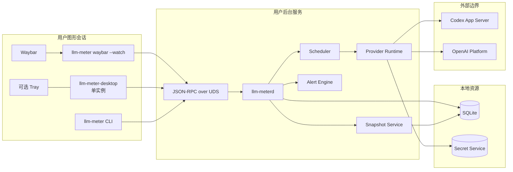
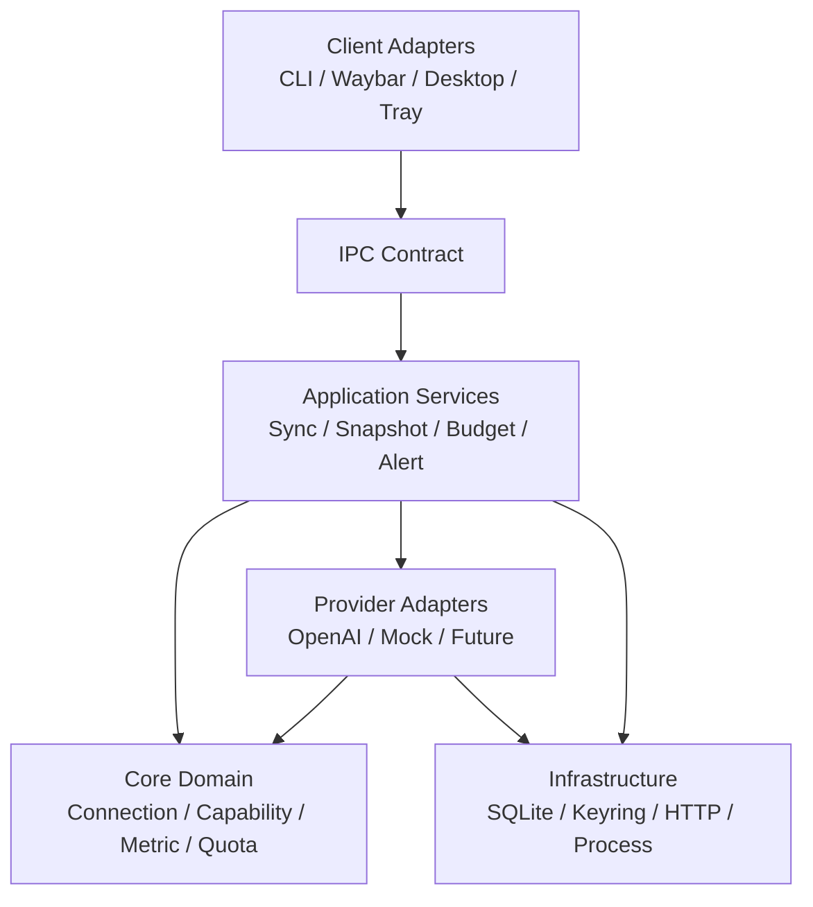

# LLM Meter 架构总览

> 版本：v0.1\
> 状态：Draft / 架构基线\
> 日期：2026-07-13\
> 详细规格：[LLM Meter 架构设计文档](./llm-meter-architecture-v0.1.md)\
> UI 基线：[桌面 UI 设计基线](./desktop-ui-design-v0.1.md)\
> 桌面 Profile：[Hyprland 桌面集成设计](./hyprland-integration-v0.1.md)

## 1. 一句话架构

LLM Meter 是一个本地优先的用量与额度平台：常驻 daemon 负责认证、Provider 同步、归一化、持久化和告警；CLI、Waybar 与桌面 UI 通过用户私有的本地 IPC 读取同一份 Snapshot，任何前端都不直接访问 Provider，也不持有 Secret。

## 2. v0.1 的系统边界

### 2.1 系统负责

- 管理同一 Provider 下多条独立 Connection；
- 接入 ChatGPT Subscription 和 OpenAI Platform Admin；
- 把 Provider 数据归一化为 Capability、Metric、Quota Window 和 Provenance；
- 在本地保存历史指标、同步状态、预算与告警；
- 向 CLI、Waybar 和桌面 UI 提供一致的只读 Snapshot；
- 使用操作系统凭据库保存 API Key 和认证 Token；
- 在断网、限流、认证失效时继续提供有时间标记的缓存数据；
- 在 Hyprland 中提供可预测的浮动弹窗、Waybar 点击和用户级服务体验。

### 2.2 系统不负责

- 抓取 ChatGPT 网页或浏览器 Cookie；
- 从百分比推测剩余 Token；
- 把 Subscription、API Usage、API Cost、Credits 或本地预算合并成一个“余额”；
- 把前端刷新等同于 Provider 网络刷新；
- 把本地观测数据伪装成 Provider 官方全账户数据；
- 在 v0.1 动态加载不可信第三方 Adapter；
- 在 Hyprland 中修改用户的全局配置或依赖私有 compositor API 才能运行。

## 3. 运行时拓扑



关键生命周期：

- `llm-meterd` 是与图形界面无关的 systemd user service；
- `llm-meter waybar --watch` 是 Waybar 管理的长连接客户端，退出后可由 Waybar 重启；
- `llm-meter-desktop` 是图形会话内的单实例客户端，进程可以常驻，但 Popup 窗口按需创建和销毁；
- Codex App Server 只由 OpenAI Subscription Adapter 按需启动并监管；
- CLI 是短生命周期进程，不复制 daemon 的业务逻辑。

## 4. 逻辑分层与依赖方向



依赖只能向内指向稳定契约：

| 层 | 允许知道 | 不允许知道 |
|---|---|---|
| Core Domain | 领域类型、纯规则 | OpenAI 字段、SQLite、Tauri、Hyprland |
| Provider Adapter | Core 契约、受控网络/进程接口 | UI、Waybar、具体 Repository 实现 |
| Application Services | Core、Adapter 和 Port | WebView 状态、用户桌面配置 |
| Infrastructure | Port 的具体实现 | UI 展示决策 |
| Client Adapters | 版本化 IPC DTO | Secret、Provider HTTP、数据库表 |

这条依赖规则是“增加第二个 Provider 无需修改概览页厂商分支”的前提。

## 5. 组件职责

| 组件 | 唯一职责 | 关键输出 |
|---|---|---|
| Provider Runtime | 选择 Adapter、加载 Secret、执行超时/取消、监管子进程 | 原始 `SyncBatch` 或标准错误 |
| Normalizer | 校验并映射 Provider 数据，传播 Scope 和 Provenance | 归一化记录 |
| Repository | 事务 upsert、去重、Cursor 原子推进、查询 | 持久化状态 |
| Scheduler | 每 Connection 串行调度、退避、优先级 | 同步任务状态 |
| Snapshot Service | 从 Repository 构建客户端只读模型 | `Snapshot` |
| Alert Engine | 对新提交状态计算阈值和抑制策略 | 告警事件 |
| IPC Server | 认证本地调用者、版本协商、方法路由 | JSON-RPC 响应/事件 |
| Waybar Adapter | 把 Snapshot 压缩成 JSONL | text、tooltip、class、percentage |
| Desktop UI | Capability 驱动展示和用户操作编排 | 无 Secret 的视图状态 |

## 6. 数据所有权与单一事实来源

| 数据 | 事实来源 | 其他层如何使用 |
|---|---|---|
| API Key / OAuth Token | OS Credential Store | daemon 通过 opaque credential ref 临时读取 |
| Connection 与历史指标 | SQLite | 只能经 Repository 访问 |
| 同步 Cursor / retry 状态 | SQLite | Scheduler 恢复任务状态 |
| 当前展示状态 | daemon 生成的 Snapshot | IPC 客户端只读消费 |
| 前端导航、展开状态 | Desktop 内存 | 不回写领域数据 |
| 非敏感偏好 | XDG config | daemon/客户端读取所属配置段 |
| Provider 原始响应 | 默认不持久化 | Adapter 内短暂解析后丢弃 |

Snapshot 是读模型，不是新的事实来源。Waybar 或 Desktop 不能把格式化后的值写回数据库。

## 7. 四条主链路

### 7.1 同步写入

```text
Scheduler
  → Provider Runtime
  → Provider Adapter
  → SyncBatch
  → Normalizer
  → Repository transaction
  → Cursor commit
  → Alert evaluation
  → Snapshot invalidation / event
```

事务失败时 Cursor 不得推进；重试同一批数据依赖稳定 `dedup_key` 保持幂等。

### 7.2 Snapshot 读取

```text
Client → local IPC → Snapshot Service → Repository/cache → versioned DTO
```

读取 Snapshot 不触发 Provider 请求。`connections/refresh` 是显式的异步同步请求，返回“已接受/被限流”，而不是等待外部请求完成。

### 7.3 认证

```text
Desktop → daemon begin_auth
daemon → Adapter / browser or device challenge
daemon → Secret Store
daemon → capability probe
daemon → Connection ready
Desktop ← non-secret connection state
```

认证挑战可以进入 UI；可复用凭据不能进入 UI、IPC 响应、命令行参数或日志。

### 7.4 桌面激活

```text
Waybar / keybind / tray
  → llm-meter ui --toggle
  → desktop single-instance activation
  → create or destroy Popup xdg-toplevel
  → Hyprland applies window rule
  → Desktop reads Snapshot over IPC
```

Hyprland 下每次打开都重新创建 Popup surface，使窗口规则能在当前 workspace 和当前 monitor 重新求值。普通主窗口是另一种 Window Role，不套用 Popup 规则。

## 8. 核心契约

### 8.1 Provider Adapter

Adapter 必须提供 Manifest、认证方式、Capability Probe、增量同步和断开清理。Adapter 返回领域批次，不直接写数据库，也不决定 UI 布局。

### 8.2 Repository

Repository 必须保证：

- 连接、指标、Quota、Capability 和 Cursor 同事务提交；
- `dedup_key` 唯一；
- Missing 保持缺失，不被转换为零；
- 删除 Connection 级联删除业务数据，并由应用服务协调删除 Secret；
- migration 版本明确且可前向升级。

### 8.3 IPC

- Linux 使用 `$XDG_RUNTIME_DIR/llm-meter/daemon.sock`；
- runtime 目录权限 `0700`，socket 权限 `0600`；
- JSON-RPC 方法和 DTO 版本化；
- 连接时返回 Core、IPC 和 Schema 版本；
- 响应使用 allowlist DTO，不对数据库实体直接序列化；
- 错误信息脱敏，不返回 Provider 原始响应。

### 8.4 Snapshot

每个 Connection 至少携带：身份、类型、状态、Capability、最后成功时间和数据新鲜度。Metric/Quota 必须保留 Scope、Period 和 Provenance。没有数据时省略字段，而不是填 `0`。

### 8.5 Waybar 选择规则

当空间不足时，Waybar 采用确定性优先级：

1. 认证失效、Provider 错误或 stale 状态；
2. 用户配置的主 Connection / 主 Quota Window；
3. 未配置时选择剩余比例最低的有效 Quota Window；
4. 次要位置显示今日 Token 或实际费用；
5. 没有有效比例时省略 `percentage`，不得输出 `0` 伪装为额度耗尽。

## 9. 状态、一致性与降级

Connection 状态机为：

```text
Connecting → Ready ↔ Syncing
                    ├→ RateLimited → Syncing
                    ├→ Offline → Syncing
                    ├→ AuthRequired → Connecting
                    └→ ProviderError → Syncing
Ready → Stale
Ready ↔ Disabled
```

降级原则：

- 网络失败保留最后成功数据，并显示 `last_success_at` 与 stale；
- 单个 Connection 失败不阻断其他 Connection；
- 单个指标解析失败时，若批次仍可安全提交，记录指标级错误而非伪造值；
- Secret Store 不可用时停止需要凭据的同步，不回退到明文；
- daemon 不可用时，Waybar 输出 `daemon-offline` 状态，Desktop 显示恢复动作。

## 10. 安全边界

```text
不可信：Provider 响应、用户可编辑显示名、IPC 请求参数
受控：Adapter、Normalizer、IPC handler、Repository
敏感：Secret Store 返回值、认证子进程 stdio
展示：Snapshot DTO、Waybar JSON、Desktop ViewModel
```

必须执行：

- Provider 响应做长度、类型和必填字段校验；
- 日志对 Bearer、Cookie、API Key、Token 做结构化遮蔽；
- WebView 使用最小 Tauri Capability，不能执行任意 shell；
- Desktop 只调用预定义 IPC 方法；
- Waybar tooltip 对可变文本转义；
- daemon 和 Desktop 都以普通用户运行，不要求 root。

## 11. Hyprland 平台 Profile

Hyprland 适配不侵入 Core Domain。平台差异只出现在 Desktop Window Host、打包配置和用户集成文档中。

v0.1 选择：

- 原生 Wayland，不强制 XWayland；
- 普通 Tauri `xdg-toplevel`，不使用 layer-shell；
- Popup 位置由 Hyprland window rule 决定，因为 Wayland 不提供应用可用的全局坐标；
- Popup 与 Main Window 使用稳定且不同的初始标题，以便只匹配 Popup；
- Waybar 使用连续 JSONL 客户端，并关闭点击后的自动重启；
- UWSM 是推荐会话管理方式，但不是硬依赖；
- 通知通过标准 session D-Bus 通知服务发送；
- 详细配置、兼容版本和测试矩阵见 [Hyprland 桌面集成设计](./hyprland-integration-v0.1.md)。

## 12. 目标目录与模块映射

```text
llm-meter/
├── crates/
│   ├── core/                 # 纯领域模型与规则
│   ├── storage/              # Repository / SQLite / migrations
│   ├── secret-store/         # OS Credential Store ports/adapters
│   ├── provider-openai/      # OpenAI Adapter
│   ├── daemon/               # Application Services / IPC / scheduler
│   ├── cli/                  # CLI 与 Waybar adapter
│   └── provider-testkit/     # Adapter contract tests / Mock Provider
├── apps/desktop/             # Tauri host + Web frontend
├── schemas/                  # 外部协议与 manifest schema
├── packaging/                # systemd、desktop entry、发行版包
└── docs/                     # 架构、UI、平台 Profile、ADR
```

## 13. 交付顺序与架构闸门

| 阶段 | 交付物 | 进入下一阶段的闸门 |
|---|---|---|
| Phase 0 | Core、Repository、IPC、Mock Provider、Waybar MVP | Provider-neutral contract 与幂等集成测试通过 |
| Phase 1 | OpenAI Subscription | fixture 版本测试、认证恢复、Quota/Token 缺失值测试通过 |
| Phase 2 | OpenAI Admin | Usage/Costs 增量同步、口径和预算标签测试通过 |
| Phase 3 | Desktop / Hyprland | 单实例、窗口角色、多显示器、Waybar、UWSM/非 UWSM 验收通过 |
| Phase 4 | 第二 Provider / Proxy | 无 Core 厂商分支，Provenance 与安全审查通过 |

## 14. 实现前仍需闭合的问题

这些问题不改变当前分层，但必须在对应 Phase 开始前形成 ADR 或测试结论：

- Desktop 前端最终选择 Svelte 还是 React；
- Codex App Server 的目标版本、协议 fixture 和兼容窗口；
- Subscription 能力在不同账户类型下的真实返回矩阵；
- Flatpak 是否进入 v0.1；若进入，需要补充 D-Bus 单实例与 socket 访问权限；
- Snapshot 采用请求/响应轮询还是在 JSON-RPC 上增加订阅事件；
- Popup 的默认顶栏/底栏定位 Profile 是否在安装时自动生成；
- 支持的最低 Hyprland 版本与发行包矩阵。

## 15. 架构不变量检查表

任何设计或实现变更合入前，应能回答“是”：

- 新数据是否绑定明确的 `connection_id`？
- Metric 是否保留 Unit、Scope、Period 和 Provenance？
- 缺失数据是否仍为缺失而非零？
- Provider 特例是否被限制在 Adapter 内？
- Cursor 是否只在完整事务成功后推进？
- Secret 是否完全避开数据库、日志、IPC DTO 和 WebView？
- Waybar/Desktop 是否只读本地 Snapshot？
- daemon 是否仍不依赖图形会话？
- Hyprland 适配是否仍可被其他 compositor Profile 替换？
- 用户能否看到 stale、最后同步时间与可执行恢复动作？
