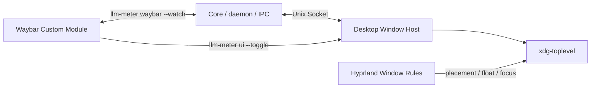

# LLM Meter Hyprland 桌面集成设计

> 版本：v0.1\
> 状态：Draft / Hyprland 平台规范\
> 基线日期：2026-07-13\
> 目标：Linux、原生 Wayland、Hyprland、Waybar\
> 上位架构：[LLM Meter 架构设计文档](./llm-meter-architecture-v0.1.md)\
> 视觉与交互：[桌面 UI 设计基线](./desktop-ui-design-v0.1.md)

## 1. 目标与适用范围

本文定义 LLM Meter 在 Hyprland 桌面环境中的运行、窗口、Waybar、会话服务和验收约束。它只补充平台集成，不改变 Provider、Metric、Quota、Repository 或 Secret Store 的核心语义。

v0.1 支持基线：

- 原生 Wayland 会话，`XDG_SESSION_TYPE=wayland`；
- Hyprland 0.55+ 的 Lua 配置作为当前主路径；
- Hyprland 0.54 的 hyprlang 配置作为兼容路径；
- Waybar Custom Module；
- systemd user service；
- UWSM 会话和非 UWSM 会话；
- 单显示器、多显示器、整数缩放和混合缩放；
- Tauri v2 / WebKitGTK 桌面窗口；
- 可选 StatusNotifier/AppIndicator Tray；
- 标准 freedesktop.org session D-Bus 通知。

本文不承诺：

- Popup 与 Waybar 模块像素级锚定；
- 在所有 Wayland compositor 上复用 Hyprland window rule；
- 在锁屏之上显示窗口；
- 默认使用 XWayland 规避原生 Wayland 问题；
- 自动修改用户的 `hyprland.lua`、`hyprland.conf` 或 Waybar 配置。

## 2. 平台约束与架构结论

### 2.1 Wayland 不允许普通应用控制全局坐标

Tauri 在 Linux 上使用 WebKitGTK，并通过 TAO 创建窗口。TAO 明确说明 `set_outer_position` 在 Linux/Wayland 上不受支持，因为 Wayland 没有提供给普通客户端的全局坐标系。

因此：

- Desktop 不得把 `set_position` 或 Tauri Positioner 当作 Hyprland 定位保证；
- Waybar 的 `on-click` 不会把模块矩形传给 LLM Meter；
- Popup 的位置由 Hyprland window rule 决定；
- 没有用户 window rule 时，应用仍然可用，只是由 compositor 自行放置；
- 多显示器下不能用 X11 风格的全局像素坐标保存窗口位置。

### 2.2 v0.1 不采用 layer-shell

Waybar 本身是 layer-shell surface；Tauri 主窗口是普通 `xdg-toplevel`。v0.1 保持普通窗口，理由是：

- Tauri 主路径不原生提供 layer-shell；
- 普通窗口保留标准键盘焦点、辅助功能和跨平台窗口模型；
- Hyprland window rule 已能满足“浮动、定尺寸、靠近顶栏”的主要体验；
- 不把 compositor 特有实现带入 Desktop Core。

以下任一需求成为硬性要求时，再记录 ADR 评估 layer-shell 或独立 GTK/Wayland Popup Host：

- 必须精确贴住被点击的 Waybar 模块；
- 必须拥有 layer-shell 的 anchor、exclusive zone 或 keyboard interactivity；
- 必须在普通 workspace 切换之外保持 overlay 语义。

### 2.3 Hyprland 适配属于平台 Profile



Core 不调用 `hyprctl`，daemon 不读取 Hyprland socket，Provider Adapter 不感知窗口管理器。Hyprland 依赖被限制在用户配置、Desktop Window Role 和打包说明中。

## 3. 进程与会话模型

| 进程 | 生命周期 | 图形会话依赖 | systemd 归属 |
|---|---|---|---|
| `llm-meterd` | 用户登录期间常驻 | 无 | `default.target` |
| `llm-meter waybar --watch` | 与 Waybar module 同寿命 | 间接依赖 Waybar | 由 Waybar 管理 |
| `llm-meter-desktop` | 按需或 Tray 常驻 | 有 | 图形会话 / app scope |
| Popup window | 每次激活创建，关闭时销毁 | 有 | Desktop 进程内部 |
| Main window | 用户显式打开 | 有 | Desktop 进程内部 |
| Codex App Server | Subscription 同步期间按需监管 | 无 | daemon 子进程/监管单元 |

强制约束：

- daemon 在 Waybar 或 Desktop 未运行时仍可同步；
- 关闭 Popup 不得停止 daemon；
- Waybar 重启不得中断同步；
- Hyprland 退出时 Desktop 应随图形会话结束，daemon 可以继续存在；
- Desktop 只允许一个进程实例，但一个进程可以先后创建多个窗口 surface；
- daemon socket 固定为 `$XDG_RUNTIME_DIR/llm-meter/daemon.sock`。

## 4. Desktop Window Role

### 4.1 稳定窗口身份

实现和打包必须固定以下公开身份，不能随前端框架或构建模式变化：

| 属性 | Popup | Main Window |
|---|---|---|
| Bundle/Application ID | `io.github.llmmeter` | `io.github.llmmeter` |
| Tauri window label | `popup` | `main` |
| 初始 compositor title | `LLM Meter Popup` | `LLM Meter` |
| 默认尺寸 | 360 × 440 logical px | 900 × 720 logical px |
| 默认行为 | 浮动、无原生装饰、可自动收起 | 普通、可缩放、可平铺 |

Hyprland 的静态规则在窗口创建时求值，所以 `class` 和初始 `title` 必须在创建 surface 前就正确，不能依赖页面加载后改标题。

实现阶段必须在原生 Wayland 构建上用以下命令核实实际 `class`、`initialClass`、`title` 和 `xwayland`：

```bash
hyprctl clients
```

如果 GTK/TAO 暴露的 class 与约定 Application ID 不一致，应先修正打包/窗口身份；不应把随机开发期 class 写入发布配置。

### 4.2 Popup 行为

Popup 是短生命周期 view surface，不是第二个应用实例：

- 默认逻辑尺寸 360 × 440；
- 使用应用内标题栏，Hyprland 规则只负责 compositor 外框；
- `Escape`、关闭按钮和再次点击 Waybar 可销毁 Popup；
- Popup 模式可以在失去焦点后收起，但必须避免在文件选择器、OAuth 浏览器或系统对话框切换时误杀领域操作；
- 销毁 Popup 后，Tray 模式下 Desktop 进程继续运行；
- 下次打开重新创建 surface，使 Hyprland 在当前 workspace/monitor 重新应用静态规则；
- 不设置 `pin`，不跨所有 workspace 显示；
- 不使用 `stay_focused` 抢占用户焦点；
- 不显示在锁屏 layer 之上。

Popup 的视觉基线是紧凑的深色状态中心：顶部 Header、Primary Quota、Today Summary、一张 Primary Trend、次要额度列表和 Footer。它可以借鉴系统监控 Popup 的卡片密度与双强调色，但首屏不堆叠多张同等权重的趋势图。具体规范见[桌面 UI 设计基线](./desktop-ui-design-v0.1.md)。

### 4.3 Main Window 行为

Main Window 用于“固定为普通窗口”和长时间分析：

- 不匹配 Popup 的浮动规则；
- 允许 Hyprland 正常平铺、分组、移动和缩放；
- 关闭 Main Window 只关闭视图，不影响 daemon；
- Popup 中的“固定”操作应销毁 Popup，再创建/聚焦 Main Window；
- Main Window 和 Popup 读取同一 Snapshot，不复制状态源。

## 5. UI 激活契约

CLI 面向桌面激活提供以下稳定语义：

```text
llm-meter ui              等价于 ui --show
llm-meter ui --show       幂等地显示/聚焦 Popup
llm-meter ui --toggle     在当前上下文切换 Popup
llm-meter ui --hide       销毁 Popup
llm-meter ui --main       显示/聚焦 Main Window
```

`--toggle` 状态规则：

| 当前状态 | 动作 |
|---|---|
| Desktop 未运行 | 启动单实例进程并创建 Popup |
| Desktop 运行，Popup 不存在 | 在当前 workspace 创建 Popup |
| Popup 可见且已聚焦 | 销毁 Popup |
| Popup 可见但未聚焦 | 聚焦 Popup，不把第一次点击解释为关闭 |
| Main Window 可见 | 不关闭 Main Window；只控制 Popup |

单实例通知必须携带结构化 action，而不是让第二实例直接操作 compositor。Tauri 的 single-instance 插件在 Linux 上使用 session D-Bus；如果未来发布 Flatpak/Snap，必须额外声明对应 D-Bus own/talk 权限。

焦点策略：

- Waybar 点击、Tray 点击和键盘绑定属于用户发起的激活；
- Desktop 可以请求 focus；Hyprland rule 启用 `focus_on_activate`；
- focus 请求被 compositor 拒绝时，窗口仍应显示并可由用户选择；
- Core 不使用 `hyprctl dispatch focuswindow` 作为必需回退。

## 6. Hyprland 0.55+ 配置基线

Hyprland 0.55 起使用 Lua 配置。建议把 LLM Meter 规则放在独立文件，避免影响主配置的错误隔离。

主配置：

```lua
-- ~/.config/hypr/hyprland.lua
require("conf.d.llm-meter")
```

默认顶栏、右上角 Popup Profile：

```lua
-- ~/.config/hypr/conf.d/llm-meter.lua
local llm_meter_class = [=[^io\.github\.llmmeter$]=]
local llm_meter_popup_title = [=[^LLM Meter Popup$]=]

hl.window_rule({
  name = "llm-meter-popup",
  match = {
    class = llm_meter_class,
    title = llm_meter_popup_title,
  },
  float = true,
  size = {360, 440},
  move = {"monitor_w-window_w-12", "42"},
  no_max_size = true,
  focus_on_activate = true,
  animation = "popin 90%",
})
```

说明：

- `42` 假设顶栏约 30 logical px，并保留 12 px 间距；用户应按自己的 Waybar 高度调整；
- `monitor_w`、`window_w` 等表达式是 monitor-local，适用于多显示器；
- `class + title` 双条件保证 Main Window 不被强制浮动；
- 不设置 `monitor` 或 `workspace`，让新 surface 出现在当前交互上下文；
- 不设置固定 `max_size`，避免 WebKitGTK 报告不合理上限时阻塞目标尺寸；
- 规则顺序会影响最终效果，用户自己的后置规则可以覆盖本规则。

底栏 Profile 只替换 `move`：

```lua
move = {"monitor_w-window_w-12", "monitor_h-window_h-42"},
```

右侧 Waybar、希望靠近鼠标位置时可以选用 Cursor Profile：

```lua
move = {"cursor_x-window_w+12", "cursor_y+12"},
```

Cursor Profile 不是默认值：当入口靠近左边缘或底边时可能需要用户按布局调整，且它仍不是 Waybar 模块几何锚定。

可选隐私规则会让 Hyprland 在屏幕共享中遮蔽窗口：

```lua
hl.window_rule({
  match = {
    class = llm_meter_class,
    title = llm_meter_popup_title,
  },
  no_screen_share = true,
})
```

该规则必须由用户主动开启，不能作为默认值，因为它也会影响用户主动分享 LLM Meter 的场景。

### 6.1 快捷键

普通会话：

```lua
hl.bind(
  "SUPER + SHIFT + M",
  hl.dsp.exec_cmd("llm-meter ui --toggle"),
  { description = "Toggle LLM Meter" }
)
```

UWSM 会话推荐把应用放入图形 app scope：

```lua
hl.bind(
  "SUPER + SHIFT + M",
  hl.dsp.exec_cmd("uwsm app -- llm-meter ui --toggle"),
  { description = "Toggle LLM Meter" }
)
```

快捷键不应设置 `locked`，避免锁屏期间打开包含账户数据的窗口。

## 7. Hyprland 0.54 兼容配置

0.54 使用 hyprlang。发布文档必须提醒用户先运行 `hyprctl version`，并选择同版本 Wiki 语法；不要把 0.55+ Lua 片段粘贴到 `hyprland.conf`。

```ini
# ~/.config/hypr/conf.d/llm-meter.conf
windowrule {
    name = llm-meter-popup
    match:class = ^io\.github\.llmmeter$
    match:title = ^LLM Meter Popup$

    float = on
    size = 360 440
    move = (monitor_w-window_w-12) 42
    no_max_size = on
    focus_on_activate = on
    animation = popin 90%
}

bind = SUPER SHIFT, M, exec, llm-meter ui --toggle
```

主配置通过以下方式包含：

```ini
source = ~/.config/hypr/conf.d/llm-meter.conf
```

如果使用 UWSM，把 bind 的命令改为：

```ini
bind = SUPER SHIFT, M, exec, uwsm app -- llm-meter ui --toggle
```

## 8. Waybar 集成

### 8.1 进程模式

`llm-meter waybar --watch` 是连续 JSONL producer：

- 启动后连接 daemon 的 Unix socket；
- 初始立即输出一行完整 JSON；
- Snapshot 变化或心跳时输出下一行；
- 不直接访问 OpenAI；
- daemon 暂时不可用时保持退避重连并输出本地错误状态；
- 收到 SIGTERM 时退出；
- stdout 只包含协议 JSONL，诊断日志写 stderr；
- 每行必须是单个完整 JSON object，不能输出 banner。

Waybar 对没有 `interval` 或 `signal` 的 custom module 按连续脚本处理。`restart-interval` 只负责 producer 异常退出后的恢复。

### 8.2 推荐配置

```jsonc
{
  "custom/llm-meter": {
    "exec": "llm-meter waybar --watch",
    "return-type": "json",
    "format": "{text}",
    "tooltip": true,
    "escape": true,
    "exec-on-event": false,
    "on-click": "llm-meter ui --toggle",
    "on-click-right": "llm-meter ui --main",
    "restart-interval": 5
  }
}
```

必须把 `custom/llm-meter` 加入目标 bar 的 `modules-left`、`modules-center` 或 `modules-right`。

这里显式设置 `exec-on-event: false`，因为 Waybar 默认会在点击事件后重新执行 custom script；连续 watch 进程不应因每次打开 UI 而重启。

### 8.3 JSON 输出契约

正常状态：

```json
{
  "text": "OAI 63% · 1.26M",
  "tooltip": "OpenAI · ChatGPT Pro\nCodex: 63% remaining\nToday: 1.26M tokens\nReset: 2h 14m",
  "class": ["provider-openai", "quota-ok"],
  "percentage": 63
}
```

daemon 不可用：

```json
{
  "text": "LLM offline",
  "tooltip": "LLM Meter daemon unavailable",
  "class": ["daemon-offline"]
}
```

没有有效 Quota 比例时必须省略 `percentage`，不能填 `0`。`0` 只表示 Provider 明确报告额度已经耗尽。

允许的状态 class：

```text
provider-openai
quota-ok
quota-warning
quota-critical
quota-exhausted
sync-stale
auth-required
provider-error
daemon-offline
```

多个 class 可以同时存在，例如 `provider-openai sync-stale quota-warning`。CSS 不应只依赖单个互斥 class。

### 8.4 CSS 基线

```css
#custom-llm-meter {
  padding: 0 8px;
}

#custom-llm-meter.quota-warning {
  color: #f9e2af;
}

#custom-llm-meter.quota-critical,
#custom-llm-meter.auth-required,
#custom-llm-meter.provider-error,
#custom-llm-meter.daemon-offline {
  color: #f38ba8;
}

#custom-llm-meter.sync-stale {
  opacity: 0.72;
}
```

颜色只是示例，最终应继承用户 Waybar 主题。状态还必须通过文字/tooltip 表达，不能只依赖颜色。

### 8.5 Waybar 与 Tray 的关系

Hyprland 推荐 Waybar-first Profile：

- `custom/llm-meter` 是状态入口；
- 默认不额外显示 Tray icon，避免重复；
- Desktop 无需随图形会话预启动。

用户选择 Tray Profile 时：

- Waybar 配置需要包含 `tray` module；
- Desktop 以 background/tray 模式随 `graphical-session.target` 启动；
- Tray 与 custom module 读取同一 Snapshot；
- 可以只保留 Tray，也可以保留 custom module 的详细状态文字。

## 9. systemd user 与 UWSM

### 9.1 daemon 服务

daemon 与 Hyprland 解耦，建议 unit 基线如下：

```ini
[Unit]
Description=LLM Meter daemon

[Service]
Type=simple
ExecStart=%h/.local/bin/llm-meterd
Restart=on-failure
RestartSec=3
RuntimeDirectory=llm-meter
RuntimeDirectoryMode=0700
UMask=0077

[Install]
WantedBy=default.target
```

约束：

- socket 由服务创建在 `%t/llm-meter/daemon.sock`；
- socket mode 为 `0600`；
- database 和 config 继续遵循 XDG 路径；
- unit 不声明 `DISPLAY`、`WAYLAND_DISPLAY` 或 `HYPRLAND_INSTANCE_SIGNATURE`；
- daemon 不应通过 `hyprctl` 判断桌面是否存在；
- unit 不依赖 `network-online.target`；网络尚未可用时进入 Offline/退避，而不是启动失败循环。

### 9.2 UWSM

UWSM 能管理 Wayland session、systemd 环境、XDG autostart 和有序退出，是推荐但非强制的 Hyprland 会话路径。

使用 UWSM 时：

- Desktop 快捷键可以用 `uwsm app --` 启动；
- Waybar 若由 `waybar.service` 启动，其 on-click 子命令已经处于图形会话环境中，不必再套一层 UWSM；
- 不在 `hyprland.lua` 中手动设置 toolkit/Wayland 环境变量；
- 需要的图形环境变量放入 `~/.config/uwsm/env` 或 `env-hyprland`；
- daemon 不使用这些图形环境变量。

### 9.3 非 UWSM 会话

非 UWSM 环境必须确保 `graphical-session.target` 正确建立。Hyprland 官方文档提供 `hyprland-session.target` 方案；LLM Meter 不自行创建或控制该 target。

Desktop/Tray 可选 unit 应：

- `After=graphical-session.target llm-meterd.service`；
- `PartOf=graphical-session.target`；
- 只在用户启用 Tray Profile 时加入 `graphical-session.target`；
- 不把 daemon 绑定到 `graphical-session.target`。

## 10. Secret Service、D-Bus 与桌面基础设施

### 10.1 Secret Service

Linux Secret 使用 Secret Service/libsecret 后端。Hyprland 本身不提供凭据库；常见实现包括 GNOME Keyring 或 KeePassXC Secret Service。

必须处理：

- TTY 登录时 keyring 可能没有通过 PAM 自动解锁；
- keyring 锁定时 Connection 进入 `SecretStoreUnavailable`/可恢复状态；
- daemon 继续提供历史 Snapshot；
- 不允许回退到 config 文件保存明文 Secret；
- diagnostics 只报告 backend availability，不列出 Secret 名称或内容。

### 10.2 Session D-Bus

以下功能依赖 session D-Bus：

- Desktop single-instance；
- Secret Service；
- freedesktop.org Notifications；
- 部分 Portal 与桌面激活能力。

daemon IPC 仍使用 Unix socket，不能把 session D-Bus 当作业务数据主通道。这样 Waybar/CLI 的数据访问不依赖桌面 D-Bus service name。

### 10.3 XDG Desktop Portal

建议安装 `xdg-desktop-portal-hyprland`，并为文件选择器搭配 `xdg-desktop-portal-gtk`。LLM Meter v0.1 不需要屏幕共享，但浏览器打开、文件选择和未来导入/导出会受 Portal 配置影响。

Portal 缺失不应阻止 daemon 启动；Desktop diagnostics 应报告 Portal/D-Bus 状态并给出环境修复提示。

### 10.4 通知

Alert Engine 通过标准 `org.freedesktop.Notifications` session service 发送通知。Hyprland 不内置通知 daemon，用户需要运行 mako、dunst、fnott、swaync 等实现之一。

通知不可用时：

- Alert 仍写入本地数据库；
- Waybar/桌面仍显示告警；
- diagnostics 报告 notification service unavailable；
- 不因通知失败回滚指标事务。

通知 action 不是可靠能力：客户端必须容忍服务不支持 action 或 activation token。

## 11. 主题、缩放与多显示器

### 11.1 主题

Hyprland 不是完整 Desktop Environment，不保证统一的系统明暗主题来源。主题选择优先级定义为：

1. LLM Meter 用户显式选择；
2. 可用时读取标准 desktop/portal color-scheme；
3. GTK/WebView 系统偏好；
4. 应用默认主题。

主题变化只影响视图，不改变 Snapshot 或 daemon 配置。透明、模糊和 compositor 阴影属于可选外观，不能成为信息可读性的前提。

### 11.2 Logical Pixel

- 文档中的 360 × 440 是 logical px；
- WebView 使用 CSS logical pixel；
- 不按物理像素保存窗口位置；
- 1.25、1.5 等 fractional scale 下允许 1 px 舍入差；
- 图表必须提供非 WebGL fallback，避免 WebKitGTK 慢路径导致主 UI 不可用。

### 11.3 小尺寸屏幕

Popup 内容必须可滚动，并提供紧凑布局。440 logical px 无法完整容纳时：

- 不截断认证、错误恢复和关闭操作；
- Header 和主要 Quota 保持可见；
- 趋势图和次要维度可以折叠；
- 用户可用 Main Window 获取完整页面。

Hyprland 配置可以针对小屏幕把 `size` 改为 `340 400`；应用本身仍必须响应式，不能依赖用户修改规则才可操作。

### 11.4 多显示器

- 新建 Popup 默认落在触发操作所在的当前 monitor/workspace；
- Hyprland 的 `move` 表达式使用 monitor-local 变量；
- 每次 toggle 重新创建 Popup，避免隐藏窗口留在旧 workspace；
- 混合缩放切换后按 compositor 提供的新 logical size 重排；
- 拔出显示器时不保存失效全局坐标；
- Main Window 的位置恢复交给 compositor，不由 daemon 管理。

## 12. WebKitGTK 与 GPU 降级

Linux Tauri 使用系统 WebKitGTK。部分 NVIDIA/驱动组合可能出现空白窗口、闪烁、DMABUF framebuffer 错误或 Wayland protocol error。

处理顺序：

1. 保持原生 Wayland 默认，确认系统、WebKitGTK、Mesa/NVIDIA 驱动为受支持版本；
2. 确认 NVIDIA KMS/explicit sync 配置；
3. 仅在复现后尝试 `__NV_DISABLE_EXPLICIT_SYNC=1`；
4. 再尝试 `WEBKIT_DISABLE_DMABUF_RENDERER=1`；
5. 最后才尝试 `WEBKIT_DISABLE_COMPOSITING_MODE=1`。

这些 workaround 不能全部无条件写入发布 unit，因为后两项会禁用更快的渲染路径。diagnostics 应只检测已知症状和当前环境，不声称能从 WebGL renderer string 准确识别 GPU。

`GDK_BACKEND=x11` 只能是临时排障手段，不属于 v0.1 Hyprland 原生支持路径。

## 13. 打包交付物

实现阶段的 Linux 包必须提供模板，而不是直接覆盖用户配置：

```text
packaging/
├── systemd/llm-meterd.service
├── desktop/io.github.llmmeter.desktop
├── hyprland/llm-meter.lua          # 0.55+
├── hyprland/llm-meter.conf         # 0.54
├── waybar/llm-meter.jsonc
├── waybar/llm-meter.css
└── README-hyprland.md
```

安装器可以：

- 安装 systemd unit、desktop entry 和示例文件到系统 data 目录；
- 输出用户需要执行的 enable/配置步骤；
- 检查但不修改 `~/.config/hypr` 与 `~/.config/waybar`。

安装器不可以：

- 自动追加或重写用户 Hyprland/Waybar 配置；
- 强制启用隐私遮蔽、blur、pin 或 stay-focused；
- 把 Secret 写入 environment file；
- 以 root 启动 daemon。

## 14. Diagnostics 清单

`llm-meter diagnostics` 在 Hyprland 环境中应检查并脱敏输出：

```text
session.type                 wayland / other
desktop.current              Hyprland / unknown
hyprland.version             version only
wayland.display              present / missing
session.dbus                 available / unavailable
daemon.service               active / inactive / unknown
daemon.socket                available / permission-denied / missing
secret-service               available / locked / unavailable
notification-service         available / unavailable
portal.hyprland              available / unavailable
webkitgtk.version            version only
window.identity              expected / mismatch
```

禁止输出：

- `HYPRLAND_INSTANCE_SIGNATURE` 的完整值；
- D-Bus address；
- socket 内容；
- credential ref 的 secret key；
- Provider 原始响应；
- 任何 Authorization 信息。

人工排障命令：

```bash
hyprctl version
hyprctl clients
systemctl --user status llm-meterd.service
systemctl --user status xdg-desktop-portal-hyprland.service
test -S "$XDG_RUNTIME_DIR/llm-meter/daemon.sock"
```

## 15. 验收矩阵

### 15.1 必须通过

1. 原生 Wayland 下 Desktop 不依赖 XWayland 即可显示。
2. Waybar 在 Desktop 从未启动、已关闭或崩溃时仍持续显示 daemon Snapshot。
3. 连续点击 Waybar 不产生多个 Desktop 进程。
4. Popup 每次在当前 workspace 创建，Main Window 不被 Popup rule 强制浮动。
5. 顶栏 Profile 在单显示器上以 360 × 440 logical px 浮动于右上区域。
6. 双显示器下从另一 monitor 的 Waybar 触发时，新 Popup 落在该交互 monitor。
7. 100% 与 150% 缩放下内容无裁切，主要操作可达。
8. `Escape`、关闭按钮和 toggle 能收起 Popup，不停止 daemon。
9. Waybar 点击不会重启 `waybar --watch` producer。
10. daemon 重启期间 Waybar 显示 `daemon-offline` 并自动恢复。
11. 无有效 Quota 时 JSON 不包含伪造的 `percentage: 0`。
12. 认证失效、stale、Provider error 对应 class 和 tooltip 正确。
13. UWSM 会话中 Desktop 位于图形 session scope，退出 Hyprland 后不残留。
14. 非 UWSM 会话中，只要图形环境正确导入，功能等价。
15. keyring 锁定时历史数据可读，Secret 不回退到明文。
16. 没有通知 daemon 时同步与告警持久化不受影响。
17. Main Window 可以被 Hyprland 正常平铺、移动和缩放。
18. `hyprctl clients` 显示稳定 class/title，`xwayland` 为 false。

### 15.2 兼容性测试矩阵

| 维度 | 最小覆盖 |
|---|---|
| Hyprland | 0.55+ Lua；0.54 hyprlang |
| Session | UWSM；非 UWSM |
| Bar | 顶栏；底栏；双 monitor Waybar |
| Scale | 1.0；1.5；混合 1.0 + 1.5 |
| GPU | Intel/AMD 至少一种；NVIDIA 至少一种 |
| UI mode | Popup；Main Window；可选 Tray |
| daemon | ready；offline；restarting；permission denied |
| credentials | unlocked；locked；service unavailable |
| data | complete；missing metric；stale；auth required |

## 16. 已知风险与缓解

| 风险 | 影响 | 缓解 |
|---|---|---|
| Hyprland 配置语法随版本变化 | 示例失效 | 同时维护 0.55+ Lua 与 0.54 Profile；要求先检查版本 |
| Wayland 无全局坐标 | 无法精确贴住 Waybar 模块 | compositor rule 定位；需要精确锚定时重评 layer-shell |
| Desktop class 随打包变化 | window rule 不匹配 | 固定 Application ID；发布前用 `hyprctl clients` 验证 |
| 隐藏窗口留在旧 workspace | toggle 后出现在错误 monitor | 每次激活重建 Popup surface |
| D-Bus 环境不完整 | 单实例、Secret、通知失败 | UWSM/graphical-session target；diagnostics 分项检测 |
| TTY 登录未解锁 keyring | Provider 无法同步 | PAM 文档、可恢复错误、保留历史数据 |
| WebKitGTK/NVIDIA 渲染问题 | 空白或崩溃 | 分级 workaround，不全局禁用加速 |
| Waybar event 重启 watch | 点击造成状态闪断 | `exec-on-event: false` |
| Waybar + Tray 重复入口 | UI 冗余 | 明确 Waybar-first 与 Tray Profile |
| 仅用颜色表达状态 | 可访问性不足 | text、tooltip 和 class 共同表达 |

## 17. 平台决策摘要

### HYP-ADR-001：普通 xdg-toplevel + Hyprland rule

**决策**：v0.1 Popup 使用 Tauri 普通 Wayland top-level，定位交给 Hyprland rule。\
**代价**：无法获得 Waybar 模块精确几何。\
**收益**：保持 Tauri 主路径、标准焦点和可替换 compositor Profile。

### HYP-ADR-002：Popup surface 重建

**决策**：切换显示时创建/销毁 Popup，而不是长期隐藏同一个 surface。\
**代价**：每次打开有 WebView surface 创建成本。\
**收益**：静态规则在当前 workspace/monitor 重新求值，不依赖 `hyprctl` 搬运窗口。

### HYP-ADR-003：daemon 与 graphical session 分离

**决策**：daemon 属于 user `default.target`，Desktop/Tray 属于 graphical session。\
**代价**：必须分别处理 Secret Service 和图形环境暂不可用。\
**收益**：关闭/重启 Hyprland、Waybar 或 Desktop 不影响采集和本地历史。

### HYP-ADR-004：Waybar 连续 JSONL

**决策**：Waybar 使用一个长连接本地 IPC 客户端，不按秒启动 CLI。\
**代价**：需要维护重连与心跳。\
**收益**：减少进程抖动和 SQLite/IPC 开销，状态更新延迟更低。

## 18. 参考资料

- [Hyprland 0.55+ 配置入口与 Lua 迁移](https://wiki.hypr.land/Configuring/Start/)
- [Hyprland Window Rules](https://wiki.hypr.land/Configuring/Basics/Window-Rules/)
- [Hyprland Binds](https://wiki.hypr.land/Configuring/Basics/Binds/)
- [Hyprland systemd / UWSM](https://wiki.hypr.land/Useful-Utilities/Systemd-start/)
- [Hyprland 必备桌面组件](https://wiki.hypr.land/Useful-Utilities/Must-have/)
- [xdg-desktop-portal-hyprland](https://wiki.hypr.land/Hypr-Ecosystem/xdg-desktop-portal-hyprland/)
- [Waybar Custom Module Manual](https://man.archlinux.org/man/waybar-custom.5.en)
- [Tauri Single Instance](https://v2.tauri.app/plugin/single-instance/)
- [Tauri Linux WebView / WebKitGTK](https://v2.tauri.app/reference/webview-versions/)
- [Tauri Linux Graphics Issues](https://v2.tauri.app/develop/debug/linux-graphics/)
- [TAO Window：Wayland position 限制](https://docs.rs/tao/latest/tao/window/struct.Window.html)
- [Desktop Notifications Specification 1.3](https://specifications.freedesktop.org/notification/latest-single/)
