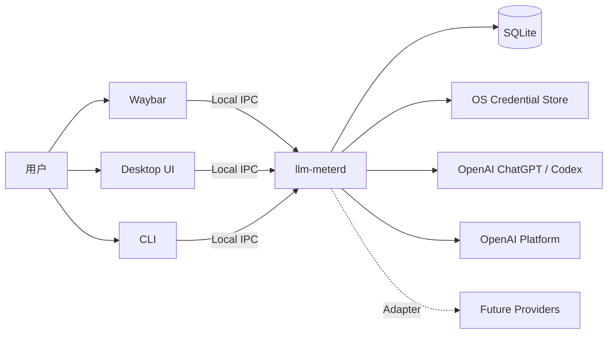
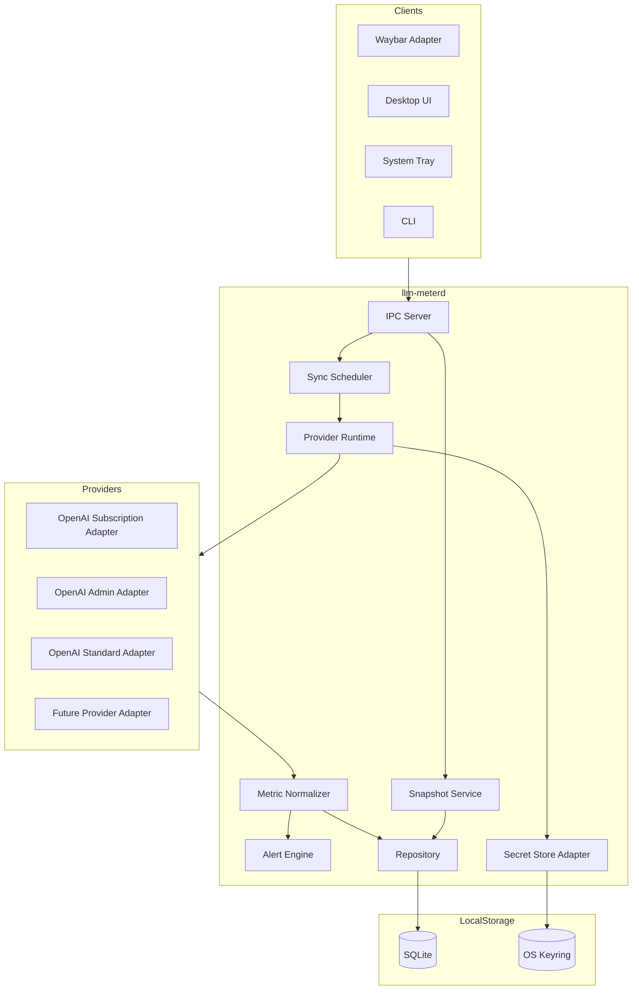
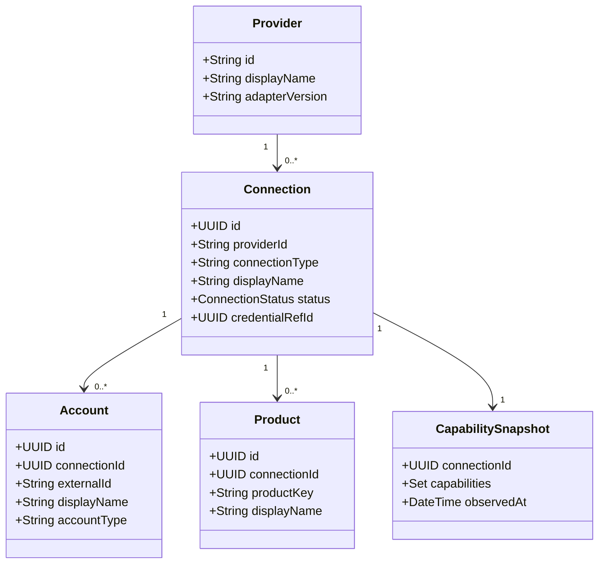
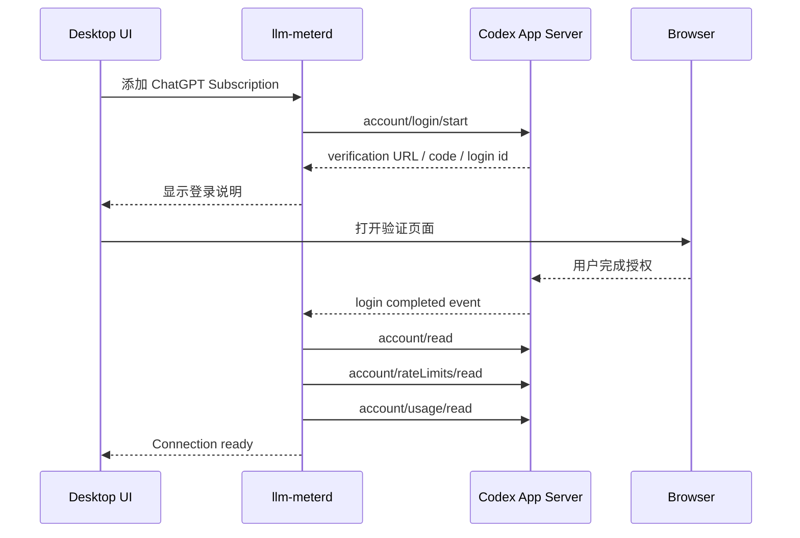
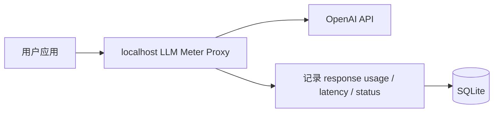
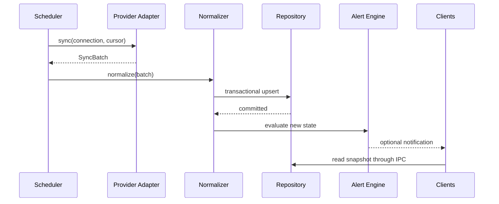
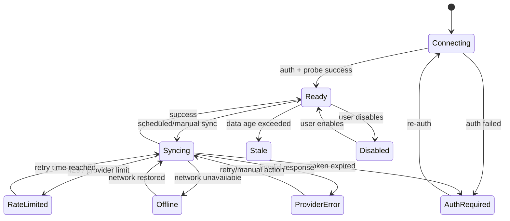

# LLM Meter 架构设计文档

> **版本**：v0.1\
> **状态**：Draft / 可进入技术评审\
> **设计基线日期**：2026-07-13\
> **首发平台**：Linux / Wayland\
> **首个 Provider**：OpenAI\
> **目标客户端**：桌面弹窗、系统托盘、Waybar、CLI
> **架构导航**：[架构总览](./architecture-overview-v0.1.md)\
> **UI 基线**：[桌面 UI 设计](./desktop-ui-design-v0.1.md)\
> **桌面 Profile**：[Hyprland 桌面集成](./hyprland-integration-v0.1.md)

---

## 目录

1. [背景与目标](#1-背景与目标)
2. [范围](#2-范围)
3. [关键术语](#3-关键术语)
4. [架构原则](#4-架构原则)
5. [总体架构](#5-总体架构)
6. [领域模型](#6-领域模型)
7. [能力模型](#7-能力模型)
8. [统一指标模型](#8-统一指标模型)
9. [额度模型](#9-额度模型)
10. [Provider Adapter 契约](#10-provider-adapter-契约)
11. [OpenAI v0.1 接入设计](#11-openai-v01-接入设计)
12. [同步与数据处理](#12-同步与数据处理)
13. [缓存效率口径](#13-缓存效率口径)
14. [本地存储](#14-本地存储)
15. [本地 IPC](#15-本地-ipc)
16. [桌面 UI 与 Waybar](#16-桌面-ui-与-waybar)
17. [认证、安全与隐私](#17-认证安全与隐私)
18. [错误处理与状态机](#18-错误处理与状态机)
19. [可观测性](#19-可观测性)
20. [测试策略](#20-测试策略)
21. [打包与部署](#21-打包与部署)
22. [项目目录](#22-项目目录)
23. [开发阶段与路线图](#23-开发阶段与路线图)
24. [验收标准](#24-验收标准)
25. [主要风险与缓解措施](#25-主要风险与缓解措施)
26. [架构决策记录](#26-架构决策记录)
27. [参考资料](#27-参考资料)

---

## 1. 背景与目标

LLM Meter 是一个本地运行的大模型订阅、API 使用量与额度监控工具。它面向以下场景：

- 查看 ChatGPT、Codex 等订阅计划的使用窗口、剩余比例和重置时间；
- 查看 OpenAI API 的输入 Token、输出 Token、缓存 Token、请求数和费用；
- 在 Waybar 中持续显示紧凑状态；
- 点击 Waybar 后打开桌面详情窗口；
- 为未来的 Anthropic、Gemini、GitHub Copilot、Cursor 等 Provider 预留扩展能力；
- 同一 Provider 下允许同时存在 Subscription 登录、普通 API Key、Admin API Key 等多种连接。

本项目的核心目标不是实现一个仅支持 OpenAI 的监控器，而是实现一个 **Provider-neutral、Capability-driven、Local-first** 的使用量与额度平台，并将 OpenAI 作为第一个 Adapter。

---

## 2. 范围

### 2.1 v0.1 必做范围

#### OpenAI ChatGPT Subscription

- 浏览器 OAuth 或 Device Code 登录；
- 显示账户信息与可用套餐信息；
- 显示一个或多个订阅额度窗口；
- 显示已用比例、剩余比例和重置时间；
- 显示账户 Token 活动摘要；
- 显示每日 Token 趋势；
- 在 Provider 返回时显示 credits、reset credits 等信息；
- 支持认证失效、限流和离线状态。

#### OpenAI Platform Admin API Key

- 保存、验证和删除 Admin API Key；
- 拉取组织 Usage；
- 显示输入、输出、缓存输入 Token；
- 显示请求数；
- 按模型、项目、API Key 等维度聚合；
- 拉取实际费用；
- 配置本地预算与告警。

#### 客户端

- 常驻后台 daemon；
- Tauri 桌面弹窗；
- 系统托盘；
- Waybar JSONL 输出；
- CLI 查询；
- 本地历史数据；
- 离线缓存；
- 数据来源标签；
- 明暗主题。

### 2.2 预留但不要求 v0.1 完整实现

- OpenAI Standard API Key 的本地代理观测；
- Codex 活跃线程的详细 Token 拆分；
- 动态加载第三方 Provider 插件；
- 云端同步；
- 多设备聚合；
- 团队共享 Dashboard；
- 费用预测与异常检测。

### 2.3 明确不做

- 抓取 ChatGPT 网页 DOM；
- 保存浏览器 Cookie；
- 调用未公开网页接口；
- 推测 Subscription 的精确剩余 Token 数；
- 将局部线程缓存率标记为全账户缓存率；
- 将本地预算标记为 Provider 硬额度；
- 将缺失值显示为零；
- 将 Subscription 与 API Platform 的统计口径混为一体；
- 将 API Key 传入前端 WebView 或写入普通配置文件。

---

## 3. 关键术语

| 术语 | 定义 |
|---|---|
| Provider | 服务厂商，例如 OpenAI、Anthropic、Google、GitHub |
| Connection | 用户在某个 Provider 下建立的一条独立连接 |
| Connection Type | 连接类型，例如 subscription、platform_admin、platform_standard |
| Auth Scheme | 认证方式，例如 OAuth、Device Code、API Key、Admin API Key |
| Account | Provider 返回的账户、组织、Workspace 或 Project 身份 |
| Product | 连接对应的产品，例如 ChatGPT、Codex、OpenAI Platform |
| Capability | 连接实际支持的功能集合 |
| Metric | 可聚合、可存储的用量、费用、请求等数值 |
| Quota Window | 有明确时间窗口、使用比例或额度值的限制对象 |
| Provenance | 指标来源：官方报告、本地观测、派生、估算或手动 |
| Scope | 指标作用范围，例如 account、organization、project、model、thread |
| Snapshot | 某一时刻供 UI 和 Waybar 读取的归一化状态 |

---

## 4. 架构原则

### 4.1 Provider-neutral

核心层不得出现以下模式：

```typescript
if (provider === "openai") {
  showOpenAIQuota();
}
```

UI 和业务逻辑应依据 Capability、MetricKey、Scope 和 Provenance 工作。

### 4.2 Capability-driven

连接支持什么，界面就展示什么。连接不支持的能力不显示，不用零值占位。

### 4.3 Connection-first

同一个 Provider 可以存在多个独立连接，例如：

```text
OpenAI
├── ChatGPT Pro Subscription
├── Organization Admin API Key
├── Personal Project API Key
└── Local Proxy Observation
```

所有指标必须绑定 `connection_id`，不能只绑定 `provider_id`。

### 4.4 Local-first

- 数据采集、存储、聚合和告警均在本地完成；
- Secret 仅保存在操作系统凭据库；
- Waybar 不直接访问外部 Provider；
- Desktop UI 不持有 Provider Secret。

### 4.5 Provenance-aware

任何数值都必须说明来源：

- Provider 官方报告；
- 本地代理或本地事件观测；
- 由正式指标派生；
- 估算；
- 用户手动配置。

### 4.6 Missing is not zero

Provider 未返回某字段时，应存储为 `NULL` 或不产生该 Metric，而不是写入 `0`。

### 4.7 Schema-tolerant

Provider 返回新增字段时不应导致程序崩溃。未知字段默认忽略，关键字段进行显式校验。

---

## 5. 总体架构

### 5.1 系统上下文



### 5.2 组件架构



### 5.3 进程模型

v0.1 建议包含以下进程：

```text
llm-meterd
├── 本地 IPC 服务
├── 同步调度器
├── Provider Runtime
├── SQLite Repository
├── Alert Engine
└── Secret Store Adapter

llm-meter-desktop（图形会话内单实例）
├── Tauri Window Host，仅通过 IPC 访问 daemon
├── Popup：按激活创建/销毁的紧凑 xdg-toplevel
├── Main Window：可平铺、可缩放的普通窗口
└── 可选 Tray：启用时保持 Desktop 进程常驻

llm-meter
├── status
├── connections
├── sync
├── ui [--show|--toggle|--hide|--main]
├── waybar --watch
└── diagnostics

codex app-server
└── 仅由 OpenAI Subscription Adapter 在需要时启动和管理
```

生命周期约束：

- `llm-meterd` 不依赖图形会话，关闭 Waybar 或 Desktop 不影响同步；
- Desktop 进程单实例，但窗口 surface 可以按需重建；
- Waybar watch 由 Waybar 管理，只消费 daemon 的本地 Snapshot；
- Desktop、CLI 与 Waybar 都不复制 Provider 同步逻辑。

---

## 6. 领域模型

### 6.1 Provider、Connection、Product 分离



### 6.2 OpenAI 示例

```text
Provider: openai

Connection A
├── connection_type: chatgpt_subscription
├── auth_scheme: oauth_device_code
├── account: user@example.com
└── product: chatgpt_codex

Connection B
├── connection_type: platform_admin
├── auth_scheme: admin_api_key
├── account: org_123
└── product: openai_platform

Connection C
├── connection_type: platform_standard
├── auth_scheme: api_key
├── account: project_456
└── product: openai_platform
```

### 6.3 Connection 状态

```rust
pub enum ConnectionStatus {
    Connecting,
    Ready,
    Syncing,
    Stale,
    AuthRequired,
    RateLimited,
    Offline,
    ProviderError,
    Disabled,
}
```

---

## 7. 能力模型

### 7.1 Capability 定义

```rust
bitflags::bitflags! {
    pub struct Capabilities: u64 {
        const ACCOUNT_INFO          = 1 << 0;
        const PLAN_INFO             = 1 << 1;
        const QUOTA_WINDOWS         = 1 << 2;
        const QUOTA_EVENTS          = 1 << 3;
        const TOKEN_TOTAL           = 1 << 4;
        const TOKEN_DAILY           = 1 << 5;
        const TOKEN_INPUT           = 1 << 6;
        const TOKEN_OUTPUT          = 1 << 7;
        const TOKEN_CACHED_INPUT    = 1 << 8;
        const TOKEN_REASONING       = 1 << 9;
        const REQUEST_COUNT         = 1 << 10;
        const COST_ACTUAL           = 1 << 11;
        const COST_ESTIMATED        = 1 << 12;
        const CREDITS_BALANCE       = 1 << 13;
        const PER_MODEL             = 1 << 14;
        const PER_PROJECT           = 1 << 15;
        const PER_API_KEY           = 1 << 16;
        const PER_THREAD            = 1 << 17;
        const EVENT_STREAM          = 1 << 18;
    }
}
```

### 7.2 OpenAI 能力映射

| Connection Type | 主要能力 |
|---|---|
| `chatgpt_subscription` | Account、Plan、Quota Window、Token Total、Daily Token、Credits；可选 Thread Token |
| `platform_admin` | Input、Output、Cached Input、Request Count、Cost、Per Model、Per Project、Per API Key |
| `platform_standard` | Connection Check；启用本地代理后支持 Locally Observed Token 和 Estimated Cost |

### 7.3 UI 渲染规则

```text
存在 TOKEN_CACHED_INPUT
    → 显示缓存效率组件

存在 COST_ACTUAL
    → 显示实际费用页面

存在 QUOTA_WINDOWS
    → 显示额度窗口卡片

只有 TOKEN_TOTAL，不存在 TOKEN_INPUT/TOKEN_OUTPUT
    → 仅显示总量，不显示输入输出拆分

不存在某项 Capability
    → 不显示对应组件
```

---

## 8. 统一指标模型

### 8.1 MetricSample

```rust
pub struct MetricSample {
    pub id: Uuid,
    pub connection_id: Uuid,
    pub metric_key: MetricKey,
    pub value: Decimal,
    pub unit: MetricUnit,
    pub scope: MetricScope,
    pub period_start: Option<DateTime<Utc>>,
    pub period_end: Option<DateTime<Utc>>,
    pub observed_at: DateTime<Utc>,
    pub provenance: Provenance,
    pub dimensions: BTreeMap<String, String>,
    pub source_metric: String,
    pub dedup_key: String,
}
```

### 8.2 MetricKey

```text
token.total
token.input
token.cached_input
token.output
token.reasoning_output

request.count

quota.used_ratio
quota.remaining_ratio
quota.limit
quota.used
quota.remaining

credit.balance

cost.actual
cost.estimated

subscription.price
budget.configured
budget.remaining
```

### 8.3 MetricUnit

```rust
pub enum MetricUnit {
    Token,
    Request,
    Ratio,
    Percent,
    Credit,
    Currency { code: String },
    Second,
    Count,
}
```

### 8.4 MetricScope

```rust
pub enum MetricScope {
    Account,
    Organization,
    Workspace,
    Project,
    ApiKey,
    Model,
    Subscription,
    Product,
    Thread,
    Device,
    LocalProxy,
}
```

### 8.5 Provenance

```rust
pub enum Provenance {
    ProviderReported,
    LocallyObserved,
    Derived,
    Estimated,
    Manual,
}
```

UI 标签：

| Provenance | UI 文案 |
|---|---|
| `ProviderReported` | 官方报告 |
| `LocallyObserved` | 本地观测 |
| `Derived` | 派生指标 |
| `Estimated` | 估算 |
| `Manual` | 手动 |

### 8.6 维度示例

```json
{
  "model": "gpt-5",
  "project_id": "proj_123",
  "api_key_id": "key_456",
  "service_tier": "default"
}
```

所有聚合操作必须验证：

- 相同 `connection_id`；
- 相同 `metric_key`；
- 兼容的 `scope`；
- 相同或可明确合并的统计周期；
- 维度聚合规则明确；
- 单位一致。

---

## 9. 额度模型

### 9.1 QuotaWindow

```rust
pub struct QuotaWindow {
    pub id: Uuid,
    pub connection_id: Uuid,
    pub provider_limit_id: String,
    pub display_name: Option<String>,
    pub window_kind: WindowKind,
    pub window_start: Option<DateTime<Utc>>,
    pub window_end: Option<DateTime<Utc>>,
    pub resets_at: Option<DateTime<Utc>>,
    pub used_ratio: Option<Decimal>,
    pub remaining_ratio: Option<Decimal>,
    pub used_value: Option<Decimal>,
    pub limit_value: Option<Decimal>,
    pub unit: Option<MetricUnit>,
    pub provenance: Provenance,
    pub observed_at: DateTime<Utc>,
}
```

### 9.2 WindowKind

```rust
pub enum WindowKind {
    Rolling,
    Fixed,
    Daily,
    Weekly,
    Monthly,
    BillingCycle,
    Unknown,
}
```

### 9.3 展示规则

允许展示：

```text
已使用：37%
剩余：63%
重置：2 小时 14 分钟后
```

只有 Provider 明确返回数值额度时，才允许展示：

```text
已用：1,200 credits
剩余：800 credits
```

禁止展示：

```text
剩余约 2.4M tokens
```

除非 Provider 明确返回原始 Token 额度。百分比不得擅自换算为 Token。

---

## 10. Provider Adapter 契约

### 10.1 核心接口

```rust
#[async_trait::async_trait]
pub trait ProviderAdapter: Send + Sync {
    fn manifest(&self) -> ProviderManifest;

    fn supported_auth_schemes(&self) -> Vec<AuthScheme>;

    async fn begin_auth(
        &self,
        request: BeginAuthRequest,
    ) -> Result<AuthChallenge, ProviderError>;

    async fn complete_auth(
        &self,
        request: CompleteAuthRequest,
        secrets: &dyn SecretStore,
    ) -> Result<ConnectionIdentity, ProviderError>;

    async fn probe_capabilities(
        &self,
        connection: &ConnectionContext,
    ) -> Result<CapabilitySnapshot, ProviderError>;

    async fn sync(
        &self,
        connection: &ConnectionContext,
        cursor: Option<SyncCursor>,
    ) -> Result<SyncBatch, ProviderError>;

    async fn disconnect(
        &self,
        connection: &ConnectionContext,
        secrets: &dyn SecretStore,
    ) -> Result<(), ProviderError>;
}
```

### 10.2 可选事件流接口

```rust
pub trait EventProvider {
    fn event_stream(
        &self,
        connection: &ConnectionContext,
    ) -> ProviderEventStream;
}
```

### 10.3 AuthScheme

```rust
pub enum AuthScheme {
    OAuthBrowser,
    OAuthDeviceCode,
    ApiKey,
    AdminApiKey,
    ServiceAccount,
    PersonalAccessToken,
    LocalSessionBridge,
    LocalProxy,
    Manual,
}
```

### 10.4 Provider Manifest

```json
{
  "provider_id": "openai",
  "display_name": "OpenAI",
  "adapter_version": "0.1.0",
  "connection_types": [
    {
      "id": "chatgpt_subscription",
      "display_name": "ChatGPT Subscription",
      "auth_schemes": [
        "oauth_browser",
        "oauth_device_code"
      ]
    },
    {
      "id": "platform_admin",
      "display_name": "OpenAI Platform Admin",
      "auth_schemes": [
        "admin_api_key"
      ]
    },
    {
      "id": "platform_standard",
      "display_name": "OpenAI Platform API",
      "auth_schemes": [
        "api_key",
        "local_proxy"
      ]
    }
  ]
}
```

### 10.5 SyncBatch

```rust
pub struct SyncBatch {
    pub account_updates: Vec<AccountRecord>,
    pub product_updates: Vec<ProductRecord>,
    pub capability_snapshot: Option<CapabilitySnapshot>,
    pub metric_samples: Vec<MetricSample>,
    pub quota_windows: Vec<QuotaWindow>,
    pub next_cursor: Option<SyncCursor>,
    pub provider_timestamp: Option<DateTime<Utc>>,
}
```

---

## 11. OpenAI v0.1 接入设计

> OpenAI 的具体接口、字段和权限可能随服务端或客户端版本变化。Adapter 必须在运行时探测 Capability，并对可选字段进行容错处理。

### 11.1 OpenAI Connection Types

```text
OpenAI
├── ChatGPT Subscription
├── OpenAI Platform — Admin API Key
└── OpenAI Platform — Standard API Key
```

### 11.2 ChatGPT Subscription

#### 11.2.1 认证

优先支持：

- 浏览器 OAuth；
- Device Code；
- 由 Codex App Server 管理登录状态和 Token 生命周期。

应用不得：

- 请求 ChatGPT 密码；
- 读取浏览器 Cookie；
- 将登录 Token 暴露给前端；
- 调用未公开的 ChatGPT 网页接口。

#### 11.2.2 进程交互

```text
llm-meterd
    │ spawn / supervise
    ▼
codex app-server
    │ stdio JSONL
    ├── initialize
    ├── initialized
    ├── account/read
    ├── account/rateLimits/read
    ├── account/usage/read
    └── notifications
```

#### 11.2.3 登录流程



#### 11.2.4 数据映射

| Provider 数据 | 归一化结果 |
|---|---|
| 账户标识 | `Account` |
| Plan Type | Product metadata / plan info |
| Rate limit bucket | `QuotaWindow` |
| Used percent | `quota.used_ratio` |
| Reset timestamp | `QuotaWindow.resets_at` |
| Lifetime tokens | `token.total`, scope=`account` |
| Daily token bucket | `token.total`, period=`day` |
| Credits | `credit.balance` |
| Thread token event | `token.input`、`token.cached_input`、`token.output` 等，scope=`thread` |

#### 11.2.5 数据范围限制

- Subscription 不等于固定 Token 池；
- 不能从使用比例可靠换算剩余 Token；
- 账户 Token 摘要不一定包含所有产品和所有交互类型；
- Thread 级数据只覆盖本地观察到的线程；
- 缓存拆分只应在 Provider 明确返回时展示。

### 11.3 OpenAI Platform — Admin API Key

#### 11.3.1 用途

用于读取组织级：

- Usage；
- Costs；
- 按模型、项目、API Key、用户等维度的聚合。

#### 11.3.2 指标映射

| OpenAI Usage 字段 | MetricKey |
|---|---|
| input tokens | `token.input` |
| cached input tokens | `token.cached_input` |
| output tokens | `token.output` |
| model requests | `request.count` |
| cost amount | `cost.actual` |

#### 11.3.3 费用口径

优先使用 Provider Costs API 的实际费用：

```text
cost.actual = Provider 返回的实际费用
```

价格表推算只能作为：

```text
cost.estimated
provenance = Estimated
```

不得用估算覆盖实际费用。

#### 11.3.4 本地预算

```text
budget.remaining = budget.configured - cost.actual
```

UI 必须标明：

```text
本地预算 / 软阈值
```

不能标成：

```text
账户余额 / Provider 硬额度
```

### 11.4 OpenAI Platform — Standard API Key

v0.1 可提供入口，但明确限制：

```text
可用：
- 验证连接
- 可选模型请求
- 未来本地代理观测

不可用：
- 完整组织历史 Usage
- 完整组织 Costs
```

未来本地代理模式：



这类数据必须标记为：

```text
provenance = LocallyObserved
scope = LocalProxy
```

并明确说明它只覆盖经过代理的请求。

---

## 12. 同步与数据处理

### 12.1 同步链路



### 12.2 默认同步频率

| 数据类型 | 方式 | 默认频率 |
|---|---|---:|
| Account / Plan | 登录、手动刷新、低频轮询 | 6 小时 |
| Subscription Rate Limits | 事件 + 轮询兜底 | 5 分钟 |
| Subscription Token Summary | 轮询 | 15 分钟 |
| API Usage | 增量查询 | 10 分钟 |
| API Costs | 增量查询 | 60 分钟 |
| Waybar Snapshot | 读取本地缓存 | 1–5 秒 |
| 告警计算 | 写入新数据后 | 即时 |

### 12.3 调度规则

- 每条 Connection 独立调度；
- 同一个 Connection 同一同步流不得并发执行；
- Provider 限流后使用指数退避；
- 用户手动刷新可以提高优先级，但不能绕过最小限流间隔；
- 前端刷新只刷新本地 Snapshot，不直接触发外部请求；
- 所有外部调用必须有超时、取消和重试上限。

### 12.4 幂等与去重

每条 MetricSample 生成稳定 `dedup_key`：

```text
hash(
  connection_id,
  metric_key,
  scope,
  period_start,
  period_end,
  normalized_dimensions,
  source_metric
)
```

同步采用事务写入：

```text
BEGIN
  upsert accounts
  upsert products
  upsert capabilities
  upsert metrics
  upsert quota windows
  update sync cursor
COMMIT
```

Cursor 只能在整个事务成功后更新。

### 12.5 离线行为

断网或 Provider 不可用时：

- 保留最后一次成功数据；
- 标记 `stale`；
- 显示最后成功同步时间；
- 不将历史数据伪装为实时数据；
- Waybar 可继续显示缓存数据并增加 stale class。

---

## 13. 缓存效率口径

### 13.1 计算条件

仅当以下条件全部满足时显示缓存效率：

1. 同一 `connection_id`；
2. 同一 `scope`；
3. 同一统计周期；
4. 同一聚合维度；
5. 同时存在 `token.input` 和 `token.cached_input`；
6. `token.input > 0`。

### 13.2 公式

```text
cache_hit_ratio = cached_input_tokens / input_tokens
```

```text
uncached_input_tokens = input_tokens - cached_input_tokens
```

```text
total_text_tokens = input_tokens + output_tokens
```

缓存输入 Token 是输入 Token 的子集，因此不得重复计数：

```text
错误：input + cached_input + output
正确：input + output
```

### 13.3 范围标签

示例：

```text
账户级缓存效率
项目级缓存效率
模型级缓存效率
本地观测线程缓存效率
```

不得将：

```text
本地观测线程缓存率
```

显示为：

```text
ChatGPT 全账户缓存率
```

---

## 14. 本地存储

### 14.1 数据库

使用 SQLite，建议启用：

```sql
PRAGMA journal_mode = WAL;
PRAGMA foreign_keys = ON;
PRAGMA busy_timeout = 5000;
```

### 14.2 主要表

```text
providers
connections
credential_refs
accounts
products
connection_capabilities
metric_samples
quota_windows
budgets
alerts
sync_states
provider_events
schema_migrations
```

### 14.3 connections

```sql
CREATE TABLE connections (
    id TEXT PRIMARY KEY,
    provider_id TEXT NOT NULL,
    connection_type TEXT NOT NULL,
    display_name TEXT NOT NULL,
    account_external_id TEXT,
    status TEXT NOT NULL,
    credential_ref_id TEXT,
    created_at TEXT NOT NULL,
    updated_at TEXT NOT NULL,
    last_success_at TEXT,
    last_error_code TEXT,
    disabled_at TEXT,
    FOREIGN KEY (credential_ref_id) REFERENCES credential_refs(id)
);
```

### 14.4 credential_refs

只存系统凭据库引用，不存 Secret：

```sql
CREATE TABLE credential_refs (
    id TEXT PRIMARY KEY,
    backend TEXT NOT NULL,
    service_name TEXT NOT NULL,
    secret_key TEXT NOT NULL,
    created_at TEXT NOT NULL
);
```

### 14.5 metric_samples

```sql
CREATE TABLE metric_samples (
    id TEXT PRIMARY KEY,
    connection_id TEXT NOT NULL,
    metric_key TEXT NOT NULL,
    value TEXT NOT NULL,
    unit TEXT NOT NULL,
    scope TEXT NOT NULL,
    period_start TEXT,
    period_end TEXT,
    observed_at TEXT NOT NULL,
    provenance TEXT NOT NULL,
    dimensions_json TEXT NOT NULL,
    source_metric TEXT NOT NULL,
    dedup_key TEXT NOT NULL UNIQUE,
    FOREIGN KEY (connection_id) REFERENCES connections(id) ON DELETE CASCADE
);

CREATE INDEX idx_metrics_connection_time
ON metric_samples(connection_id, observed_at);

CREATE INDEX idx_metrics_key_period
ON metric_samples(metric_key, period_start, period_end);
```

### 14.6 quota_windows

```sql
CREATE TABLE quota_windows (
    id TEXT PRIMARY KEY,
    connection_id TEXT NOT NULL,
    provider_limit_id TEXT NOT NULL,
    display_name TEXT,
    window_kind TEXT NOT NULL,
    window_start TEXT,
    window_end TEXT,
    resets_at TEXT,
    used_ratio TEXT,
    remaining_ratio TEXT,
    used_value TEXT,
    limit_value TEXT,
    unit TEXT,
    provenance TEXT NOT NULL,
    observed_at TEXT NOT NULL,
    UNIQUE(connection_id, provider_limit_id),
    FOREIGN KEY (connection_id) REFERENCES connections(id) ON DELETE CASCADE
);
```

### 14.7 sync_states

```sql
CREATE TABLE sync_states (
    connection_id TEXT NOT NULL,
    stream_name TEXT NOT NULL,
    cursor TEXT,
    last_attempt_at TEXT,
    last_success_at TEXT,
    next_retry_at TEXT,
    error_count INTEGER NOT NULL DEFAULT 0,
    PRIMARY KEY(connection_id, stream_name),
    FOREIGN KEY (connection_id) REFERENCES connections(id) ON DELETE CASCADE
);
```

### 14.8 数据保留

默认建议：

| 数据 | 保留策略 |
|---|---|
| 原始分钟级样本 | 30 天 |
| 小时聚合 | 180 天 |
| 日聚合 | 长期保留 |
| Provider 原始响应 | 默认不保留 |
| Provider 错误摘要 | 30 天，且脱敏 |
| 安全审计事件 | 90 天 |

---

## 15. 本地 IPC

### 15.1 传输方式

| 平台 | 方式 |
|---|---|
| Linux / macOS | Unix Domain Socket，权限 `0600` |
| Windows | Named Pipe，仅当前用户 SID |

Linux 默认路径为：

```text
$XDG_RUNTIME_DIR/llm-meter/daemon.sock
```

`$XDG_RUNTIME_DIR/llm-meter` 权限为 `0700`。客户端不得回退到 `/tmp` 中的公共 socket。

### 15.2 协议

建议采用版本化 JSON-RPC 或轻量 HTTP-over-socket。v0.1 推荐 JSON-RPC 2.0，便于 CLI、Waybar 和桌面客户端共用。

### 15.3 核心方法

```text
system/version
system/health
connections/list
connections/add
connections/remove
connections/refresh
connections/capabilities
snapshot/get
metrics/query
quotas/list
budgets/get
budgets/set
alerts/list
alerts/upsert
waybar/render
```

### 15.4 Snapshot 示例

```json
{
  "generated_at": "2026-07-13T18:40:00Z",
  "connections": [
    {
      "id": "conn_chatgpt_1",
      "provider_id": "openai",
      "connection_type": "chatgpt_subscription",
      "display_name": "ChatGPT Pro",
      "status": "ready",
      "last_success_at": "2026-07-13T18:39:12Z",
      "capabilities": [
        "plan_info",
        "quota_windows",
        "token_total",
        "token_daily"
      ],
      "summary": {
        "today_tokens": 1260000,
        "lifetime_tokens": 128400000
      },
      "quota_windows": [
        {
          "id": "codex_primary",
          "remaining_ratio": 0.63,
          "resets_at": "2026-07-13T20:54:00Z"
        }
      ]
    }
  ]
}
```

IPC 响应中不得包含：

- API Key；
- OAuth Token；
- Refresh Token；
- Cookie；
- 完整 Provider 原始响应；
- 可复用认证 Header。

---

## 16. 桌面 UI 与 Waybar

### 16.1 桌面技术栈

推荐：

- Tauri；
- Svelte 或 React；
- TypeScript；
- SVG/Canvas 图表；
- daemon-first，不在 WebView 中实现 Provider 网络请求。

### 16.2 窗口形态

Desktop 定义两种 Window Role：

```text
Popup
├── 默认 360 × 440 logical px
├── Waybar、Tray 或快捷键激活
├── 关闭时只销毁 Popup surface
└── 下次激活重新创建，以便 compositor 在当前 workspace/monitor 放置

Main Window
├── 默认 900 × 720 logical px
├── 可缩放、可平铺
└── 用于固定窗口和长时间分析
```

Popup 默认紧凑尺寸：

```text
宽度：360 px
高度：440 px
```

支持：

- Waybar 点击弹出；
- 系统托盘打开；
- 固定为普通窗口；
- 键盘快捷键切换；
- 明暗主题。

Desktop 必须是单实例。重复激活通过 session D-Bus 或平台等价机制通知已有实例，不能创建多个 WebView 进程争用同一窗口状态。

### 16.3 页面结构

```text
概览
├── Provider 汇总
├── 额度窗口
├── 今日与周期使用量
├── 趋势图
└── 告警

使用量
├── Token
├── 请求数
├── 缓存效率
├── 按模型
└── 按项目

费用
├── 实际费用
├── 本地预算
└── 费用趋势

连接
├── ChatGPT Subscription
├── Admin API Key
├── Standard API Key
└── 添加 Provider

设置
├── 刷新间隔
├── Waybar 格式
├── 告警阈值
├── 数据保留
└── 隐私与日志
```

没有 `COST_ACTUAL` Capability 时，不显示“实际费用”页面。

### 16.4 概览线框

视觉方向采用“Waybar 触发的紧凑状态中心”：深色分层 surface、顶部标题与关闭入口、主额度卡、紧凑用量摘要和一张主要趋势图。系统监控类 Popup 只作为布局与密度参考，LLM Meter 不照搬其多图表结构。完整组件、状态、视觉 Token 和可访问性规则见[桌面 UI 设计基线](./desktop-ui-design-v0.1.md)。

```text
┌──────────────────────────────────────┐
│ LLM Meter                    ● 已同步 │
│                                      │
│ OpenAI                               │
│ ChatGPT Pro                 [官方报告]│
│                                      │
│ Codex 5h window                      │
│ ████████████░░░░░░░░  63% remaining │
│ 2h 14m 后重置                        │
│                                      │
│ 今日 Token              1.26M        │
│ 累计 Token              128.4M       │
│ 单日峰值                3.14M         │
│                                      │
│ 最近 7 天                            │
│      ╭──╮          ╭───╮             │
│ ──╮╭─╯  ╰──╮╭──────╯   ╰──           │
│                                      │
│ 缓存效率             暂无账户级拆分   │
│                                      │
│ ──────────────────────────────────── │
│ OpenAI Platform               未连接  │
│ [添加 Admin API Key]                  │
│                                      │
│              [管理连接]               │
└──────────────────────────────────────┘
```

### 16.5 Waybar

配置示例：

```jsonc
{
  "custom/llm-meter": {
    "exec": "llm-meter waybar --watch",
    "return-type": "json",
    "format": "{text}",
    "tooltip": true,
    "escape": true,
    "exec-on-event": false,
    "on-click": "llm-meter ui --toggle",
    "on-click-right": "llm-meter ui --main",
    "restart-interval": 5
  }
}
```

`waybar --watch` 是连续 JSONL producer，因此不配置 `interval`，并关闭 `exec-on-event`，避免每次点击后重启 watch 进程。Waybar 只读取 daemon Snapshot，不触发外部 Provider 请求。

默认输出：

```json
{
  "text": "OAI 63% · 1.26M",
  "tooltip": "OpenAI · ChatGPT Pro\nCodex: 63% remaining\nToday: 1.26M tokens\nReset: 2h 14m",
  "class": ["provider-openai", "quota-ok"],
  "percentage": 63
}
```

Waybar class：

```text
quota-ok
quota-warning
quota-critical
quota-exhausted
sync-stale
auth-required
provider-error
daemon-offline
```

默认阈值：

```text
remaining > 50%     quota-ok
remaining 20–50%    quota-warning
remaining < 20%     quota-critical
remaining = 0%      quota-exhausted
```

没有有效额度比例时必须省略 `percentage`；不得用 `0` 表示未知。Hyprland 的窗口规则、会话管理、多显示器和兼容配置见 [Hyprland 桌面集成设计](./hyprland-integration-v0.1.md)。

---

## 17. 认证、安全与隐私

### 17.1 Secret 存储

| 平台 | 后端 |
|---|---|
| Linux | Secret Service / libsecret |
| macOS | Keychain |
| Windows | Credential Manager |

数据库只保存 Secret 引用：

```text
backend      = secret_service
service_name = io.llmmeter.openai
secret_key   = connection_<uuid>
```

### 17.2 Secret 处理规则

必须满足：

- 不写入 SQLite；
- 不写入普通配置文件；
- 不写入命令行参数；
- 不写入日志；
- 不传给桌面 WebView；
- 不出现在 IPC 响应；
- 不进入崩溃报告；
- UI 粘贴后立即清空输入状态；
- 删除 Connection 时同步删除凭据库条目；
- 日志自动遮蔽疑似 Key、Bearer、Cookie 和 Token。

### 17.3 进程权限

- daemon 以普通用户身份运行；
- 不要求 root；
- Unix Socket 权限为 `0600`；
- 数据目录权限为 `0700`；
- 数据库权限为 `0600`；
- 外部 Provider 请求仅由 daemon 发起。

### 17.4 TLS 与网络

- 只访问 Provider 官方 HTTPS Endpoint；
- 默认启用系统证书校验；
- 不允许用户关闭 TLS 校验；
- 为代理环境提供显式配置；
- 网络错误日志不记录 Authorization Header 和响应正文。

### 17.5 数据最小化

默认不保存：

- 对话正文；
- Prompt；
- Completion 文本；
- 文件内容；
- Provider 原始完整响应；
- 用户私人消息；
- 浏览器会话数据。

仅保存监控所需的账户元数据、指标、额度、费用和同步状态。

---

## 18. 错误处理与状态机

### 18.1 ProviderError

```rust
pub enum ProviderError {
    AuthenticationRequired,
    PermissionDenied,
    RateLimited { retry_at: Option<DateTime<Utc>> },
    NetworkUnavailable,
    Timeout,
    InvalidResponse,
    UnsupportedVersion,
    CapabilityUnavailable,
    SecretStoreUnavailable,
    Internal(String),
}
```

### 18.2 状态转换



### 18.3 用户可见错误

错误信息应包含：

- 可理解的原因；
- 最后成功同步时间；
- 是否影响所有数据或单个指标；
- 用户可执行操作；
- 不泄露内部 Secret 和完整响应。

示例：

```text
OpenAI Platform 需要重新认证。
上次成功同步：今天 10:42。
现有历史数据仍可查看。
[重新连接]
```

---

## 19. 可观测性

### 19.1 日志

采用结构化日志：

```text
level
timestamp
component
provider_id
connection_id
operation
latency_ms
result
error_code
```

禁止记录：

- Secret；
- Authorization Header；
- 完整 Provider Response；
- 对话内容；
- Prompt 和 Completion。

### 19.2 内部运行指标

```text
sync_duration_ms
sync_success_total
sync_failure_total
provider_rate_limit_total
ipc_request_duration_ms
sqlite_write_duration_ms
snapshot_age_seconds
alert_trigger_total
```

### 19.3 diagnostics 命令

```bash
llm-meter diagnostics
```

输出：

- 版本；
- 操作系统；
- 数据库状态；
- Secret Store 可用性；
- 已安装 Provider Adapter；
- Connection 状态；
- 最后同步时间；
- 脱敏错误码；
- 不输出 Secret。

---

## 20. 测试策略

### 20.1 单元测试

- Metric 归一化；
- 单位转换；
- 缓存率计算；
- Quota 剩余比例；
- Dedup Key；
- 时间窗口边界；
- 缺失值处理；
- Provenance 传播；
- 预算派生；
- 脱敏逻辑。

### 20.2 Provider Contract Test

`provider-testkit` 为每个 Adapter 执行统一测试：

```text
认证失败不会泄露 Secret
缺失指标不会写成零
重复同步不会重复计数
单位能够正确归一化
历史 bucket 能正确更新
Provider 新增字段不会导致崩溃
Cursor 只在事务成功后推进
Capability 与实际数据一致
删除连接会清理 Secret 引用
```

### 20.3 Mock Provider

在接入 OpenAI 前实现一个 Mock Provider，用于验证：

- 新 Provider 无需修改概览页；
- 新认证方式可由 Manifest 驱动；
- 新 MetricKey 可被通用列表展示；
- 不同 Capability 组合能够正确隐藏或显示 UI；
- 多连接聚合不串数据。

### 20.4 集成测试

- daemon + SQLite；
- daemon + Secret Store mock；
- daemon + OpenAI fixture server；
- Codex App Server JSONL fixture；
- IPC 客户端；
- Waybar 持续输出；
- 认证过期恢复；
- 限流退避；
- 断网恢复。

### 20.5 E2E 测试

```text
安装 → 启动 daemon → 添加 Subscription → 登录 → 同步 → Waybar 显示 → 打开 UI → 删除连接
```

```text
添加 Admin API Key → Usage 同步 → Costs 同步 → 缓存率展示 → 配置预算 → 触发告警
```

---

## 21. 打包与部署

### 21.1 Linux 首发

建议提供：

- Arch Linux PKGBUILD / AUR；
- Debian/Ubuntu `.deb`；
- Fedora `.rpm`；
- 通用 tarball；
- 可选 Flatpak。

### 21.2 systemd user service

```ini
[Unit]
Description=LLM Meter daemon

[Service]
Type=simple
ExecStart=%h/.local/bin/llm-meterd
Restart=on-failure
RestartSec=3
RuntimeDirectory=llm-meter
RuntimeDirectoryMode=0700
UMask=0077

[Install]
WantedBy=default.target
```

服务不依赖 `network-online.target`：用户级网络就绪信号在不同发行版上并不一致，daemon 必须通过 `Offline` 状态与退避自行处理网络尚未可用或网络切换。

### 21.3 数据目录

遵循 XDG：

```text
~/.llm-meter/config.toml
~/.llm-meter/data/llm-meter.sqlite3
~/.llm-meter/logs/llm-meterd.log
$XDG_CACHE_HOME/llm-meter/
$XDG_RUNTIME_DIR/llm-meter/daemon.sock
```

配置文件中只保存非敏感配置。daemon 属于用户 `default.target`，不得依赖 `DISPLAY`、`WAYLAND_DISPLAY` 或 Hyprland 环境；Desktop/Tray 属于图形会话，生命周期与 daemon 分离。

### 21.4 版本兼容

版本分为：

```text
Core API Version
IPC API Version
Provider Manifest Version
Database Schema Version
Adapter Version
```

IPC 必须在握手时返回版本：

```json
{
  "core_version": "0.1.0",
  "ipc_version": "1",
  "schema_version": "3"
}
```

---

## 22. 项目目录

```text
llm-meter/
├── Cargo.toml
├── crates/
│   ├── core/
│   │   ├── provider.rs
│   │   ├── capability.rs
│   │   ├── metric.rs
│   │   ├── quota.rs
│   │   ├── provenance.rs
│   │   └── errors.rs
│   │
│   ├── storage/
│   │   ├── sqlite.rs
│   │   └── migrations/
│   │
│   ├── secret-store/
│   │   ├── linux.rs
│   │   ├── macos.rs
│   │   └── windows.rs
│   │
│   ├── provider-openai/
│   │   ├── manifest.rs
│   │   ├── chatgpt/
│   │   │   ├── app_server.rs
│   │   │   ├── auth.rs
│   │   │   ├── usage.rs
│   │   │   └── rate_limits.rs
│   │   └── platform/
│   │       ├── admin_usage.rs
│   │       ├── costs.rs
│   │       └── standard_key.rs
│   │
│   ├── daemon/
│   │   ├── scheduler.rs
│   │   ├── runtime.rs
│   │   ├── ipc.rs
│   │   ├── snapshot.rs
│   │   └── alerts.rs
│   │
│   ├── cli/
│   │   ├── waybar.rs
│   │   ├── diagnostics.rs
│   │   └── commands.rs
│   │
│   └── provider-testkit/
│       ├── contract.rs
│       ├── mock_provider.rs
│       └── fixtures.rs
│
├── apps/
│   └── desktop/
│       ├── src/
│       └── src-tauri/
│
├── schemas/
│   ├── provider-manifest.schema.json
│   └── codex/
│
├── packaging/
│   ├── systemd/
│   ├── desktop/
│   ├── hyprland/
│   ├── waybar/
│   ├── deb/
│   ├── rpm/
│   └── arch/
│
└── docs/
    ├── README.md
    ├── architecture-overview-v0.1.md
    ├── llm-meter-architecture-v0.1.md
    ├── desktop-ui-design-v0.1.md
    ├── hyprland-integration-v0.1.md
    ├── provider-adapter.md
    ├── security.md
    └── adr/
```

---

## 23. 开发阶段与路线图

### Phase 0：架构骨架

目标：验证 Provider-neutral 设计。

- 建立 Cargo workspace；
- 实现 Core Domain；
- 实现 SQLite migrations；
- 实现 Secret Store abstraction；
- 实现 IPC；
- 实现 Mock Provider；
- 实现 Provider Contract Test；
- 实现最小 Waybar 输出。

### Phase 1：OpenAI Subscription

- Codex App Server 生命周期管理；
- OAuth / Device Code；
- Account 与 Plan；
- Rate Limit Windows；
- Token Summary；
- Daily Usage；
- Subscription 概览 UI；
- 认证失效恢复。

### Phase 2：OpenAI Platform Admin

- Admin API Key 安全存储；
- Usage 增量同步；
- Costs 增量同步；
- Model / Project / API Key 维度；
- 缓存率；
- 本地预算与告警；
- 费用页面。

### Phase 3：桌面体验

- Tauri 单实例 Window Host；
- Popup / Main Window 两种 Window Role；
- 系统托盘；
- 图表；
- 告警通知；
- Waybar 连续 JSONL 与配置模板；
- Hyprland 0.55+ / 0.54 Window Rule Profile；
- UWSM 与非 UWSM 图形会话；
- 多显示器与 fractional scale；
- 状态与错误恢复；
- 安装包。

### Phase 4：扩展能力

- Standard API Key Local Proxy；
- 第 2 个真实 Provider；
- 插件签名与动态加载；
- 导出 CSV / JSON；
- 数据迁移与备份；
- 高级异常检测。

---

## 24. 验收标准

v0.1 至少满足：

1. 用户可以添加一个 ChatGPT Subscription 连接。
2. 登录完成后能显示账户信息；Plan 未返回时显示“未提供”。
3. 能显示 Provider 返回的全部额度窗口，不只写死一个窗口。
4. 能显示已用比例、剩余比例和重置时间。
5. 能显示 Lifetime Token 和每日 Token；字段缺失时不显示零。
6. 用户可以另外添加 OpenAI Admin API Key。
7. Subscription 与 API Platform 数据在界面中明确分区。
8. Admin API 能显示输入、输出、缓存 Token、请求数和实际费用。
9. 缓存率只在统计口径一致时计算。
10. 本地预算明确标记为软阈值。
11. Secret 不出现在数据库、日志、IPC 和前端状态中。
12. Waybar 在桌面窗口关闭时仍可运行。
13. 断网时显示缓存数据、最后同步时间和 stale 状态。
14. 添加 Mock Provider 时不需要修改概览页 Provider-specific 逻辑。
15. 删除 Connection 后，对应凭据库 Secret 被删除。
16. 所有关键数值都可查看来源、范围和统计周期。
17. 同步重复执行不会产生重复统计。
18. Provider 返回未知字段时不会导致 daemon 崩溃。
19. Provider 限流时不会无限重试。
20. `llm-meter diagnostics` 不泄露 Secret。
21. 原生 Wayland 下无需 XWayland 即可打开 Desktop。
22. 重复点击 Waybar 不产生多个 Desktop 进程，也不重启持续运行的 watch producer。
23. Hyprland Popup 在当前 workspace/monitor 浮动，Main Window 仍可正常平铺。
24. daemon 不依赖图形会话；Hyprland/Waybar 重启不影响同步与历史数据。
25. 无有效 Quota 比例时 Waybar 省略 `percentage`，不把未知值输出为零。
26. UWSM 与非 UWSM 的支持会话中，D-Bus、Secret Service 和窗口激活失败都有可诊断状态。

---

## 25. 主要风险与缓解措施

| 风险 | 影响 | 缓解措施 |
|---|---|---|
| Subscription 接口或 Codex App Server 字段变化 | 同步失败 | 运行时 Capability 探测、Schema 容错、fixture 版本测试 |
| 某些账户不返回 Token 摘要 | 页面数据不完整 | Missing is not zero；隐藏组件并显示能力说明 |
| Subscription 无固定 Token 上限 | 无法显示精确剩余 Token | 仅展示 Provider 返回的百分比、窗口和 credits |
| Admin API Key 权限较高 | 安全风险 | OS Keyring、daemon 隔离、最小日志、权限说明 |
| Waybar 高频刷新导致外部请求 | 限流 | Waybar 只读取本地 Snapshot |
| Waybar 点击重启连续 watch | 短暂离线、额外进程 | Custom Module 设置 `exec-on-event=false` |
| Wayland 不提供全局窗口坐标 | Popup 无法由应用精确贴住 Waybar | 使用 Hyprland monitor-local window rule；精确锚定需求再评估 layer-shell |
| Hyprland 配置语法变化 | 示例与用户版本不兼容 | 分离 0.55+ Lua 与 0.54 hyprlang Profile，并要求检查版本 |
| Popup 隐藏后留在旧 workspace | 多显示器激活位置错误 | 每次激活重新创建 Popup surface |
| WebKitGTK 与部分 GPU 组合不兼容 | 空白、闪烁或崩溃 | 分级诊断和按需 workaround，不默认禁用加速 |
| 多连接数据混淆 | 错误聚合 | 所有数据强制绑定 connection_id 和 scope |
| 缓存率口径不一致 | 误导 | 严格的同连接、同周期、同范围校验 |
| Provider 费用延迟或回填 | 当日费用变化 | 显示 Provider 数据时间和最后同步时间 |
| 动态插件带来供应链风险 | 执行不可信代码 | v0.1 编译内置；未来引入签名和权限沙箱 |
| Secret Store 不可用 | 无法认证 | 明确错误状态；不回退到明文文件 |

---

## 26. 架构决策记录

### ADR-001：采用 daemon-first

**决策**：数据采集和持久化由独立 daemon 完成。\
**原因**：Waybar、桌面 UI、托盘和 CLI 可共享状态；避免重复请求 Provider。\
**代价**：增加 IPC、服务管理和进程生命周期复杂度。

### ADR-002：核心使用 Rust

**决策**：daemon、Core、Adapter 和 CLI 使用 Rust。\
**原因**：低资源占用、适合常驻、类型安全、跨平台、便于静态分发。\
**代价**：开发门槛高于纯 TypeScript。

### ADR-003：桌面端使用 Tauri

**决策**：桌面 UI 使用 Tauri + Web 前端。\
**原因**：后续可支持 macOS 和 Windows，同时复用 Rust Core。\
**代价**：Linux 原生程度低于纯 GTK4。

### ADR-004：Provider 与 Connection 分离

**决策**：同一 Provider 允许多个 Connection。\
**原因**：Subscription、Admin API Key 和 Standard API Key 的身份、权限和数据范围不同。\
**代价**：UI 和存储模型更复杂。

### ADR-005：Capability 驱动 UI

**决策**：UI 不判断 Provider 名称，而判断 Capability。\
**原因**：支持未来 Provider，无需不断增加厂商特例。\
**代价**：需要维护稳定的 Capability 语义。

### ADR-006：指标必须包含 Provenance

**决策**：每个指标记录数据来源。\
**原因**：官方数据、本地观测和估算不可混用。\
**代价**：聚合逻辑必须传播来源信息。

### ADR-007：Secret 不进入 SQLite

**决策**：Secret 只保存在 OS Credential Store。\
**原因**：降低本地数据库泄露风险。\
**代价**：需要处理各平台凭据库差异。

### ADR-008：缺失值不等于零

**决策**：Provider 未返回字段时使用 NULL 或省略 Metric。\
**原因**：避免用户误以为实际使用量为零。\
**代价**：UI 必须完整处理空状态。

### ADR-009：Subscription 和 API 数据不合并为单一额度

**决策**：Subscription、API Usage、API Cost、Credits 和本地预算分别展示。\
**原因**：统计口径、计费体系和额度含义不同。\
**代价**：概览页需要清晰的信息层级。

### ADR-010：Hyprland Popup 使用普通 xdg-toplevel

**决策**：v0.1 使用 Tauri 普通 Wayland top-level，并由 Hyprland window rule 完成浮动、尺寸和位置；不引入 layer-shell。\
**原因**：Wayland 不允许普通客户端设置全局坐标，而普通 top-level 能保持 Tauri 主路径、标准焦点和跨平台窗口模型。\
**代价**：不能保证与 Waybar 模块像素级锚定；若该需求成为硬约束，需要重新评估 layer-shell Host。

### ADR-011：daemon 与图形会话生命周期分离

**决策**：`llm-meterd` 属于用户后台服务；Desktop、Tray 和 Waybar 属于图形会话。Popup 每次激活可以重建 surface。\
**原因**：桌面组件重启不应中断同步；重建 Popup 能让 compositor 在当前 workspace/monitor 重新应用静态规则。\
**代价**：必须分别处理图形 D-Bus、Secret Service 暂不可用和 WebView 创建成本。

---

## 27. 参考资料

以下链接用于实现阶段核对具体接口与字段。正式编码时应以目标版本的官方文档和运行时响应为准。

- OpenAI Codex App Server：<https://developers.openai.com/codex/app-server>
- OpenAI API Reference Overview：<https://developers.openai.com/api/reference/overview/>
- OpenAI Organization Usage — Completions：<https://developers.openai.com/api/reference/resources/admin/subresources/organization/subresources/usage/methods/completions/>
- OpenAI Organization Costs：<https://developers.openai.com/api/reference/resources/admin/subresources/organization/subresources/usage/methods/costs/>
- OpenAI Project Budget 说明：<https://help.openai.com/en/articles/9186755-managing-your-work-in-the-api-platform-with-projects>
- Waybar Custom Module：<https://man.archlinux.org/man/waybar-custom.5.en>
- Hyprland Window Rules：<https://wiki.hypr.land/Configuring/Basics/Window-Rules/>
- Hyprland systemd / UWSM：<https://wiki.hypr.land/Useful-Utilities/Systemd-start/>
- Tauri Single Instance：<https://v2.tauri.app/plugin/single-instance/>
- TAO Wayland Window 限制：<https://docs.rs/tao/latest/tao/window/struct.Window.html>
- Desktop Notifications Specification：<https://specifications.freedesktop.org/notification/latest-single/>

---

## 附录 A：v0.1 默认告警

```text
额度剩余低于 20%
额度剩余低于 5%
额度窗口已耗尽
额度将在 15 分钟内重置
今日 Token 高于用户设定值
API 本月费用达到预算 80%
API 本月费用达到预算 100%
API 缓存率低于用户设定阈值
连接需要重新认证
数据超过 30 分钟未更新
```

## 附录 B：默认 Waybar 展示策略

单个 Subscription：

```text
OAI 63% · 1.26M
```

Subscription + API Admin：

```text
OAI 63% · API $12.43
```

错误状态：

```text
OAI auth
OAI stale
OAI error
LLM offline
```

## 附录 C：实现顺序建议

```text
1. Core Domain
2. SQLite migrations
3. Secret Store abstraction
4. IPC
5. Mock Provider
6. Provider Contract Test
7. Waybar MVP
8. OpenAI Subscription Adapter
9. OpenAI Admin Adapter
10. Desktop UI
11. Alerts
12. Packaging
```
