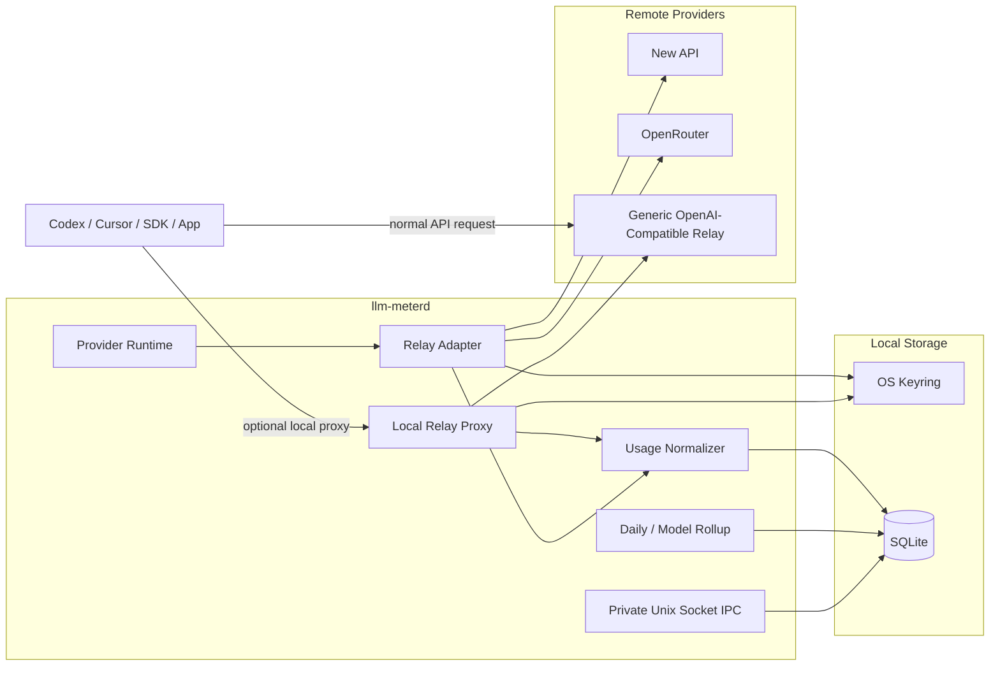
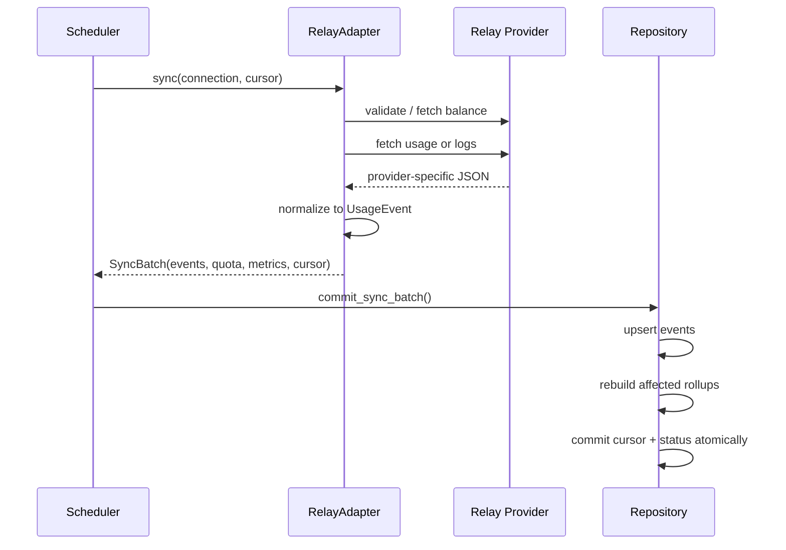
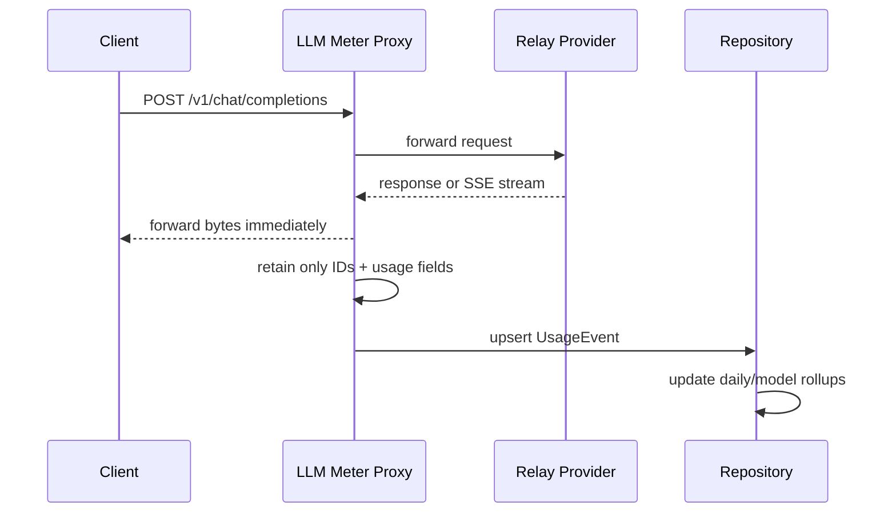

# LLM Meter 第三方中转站支持设计方案

> **文档类型**：技术设计 / RFC  
> **状态**：Draft  
> **目标仓库**：`ChenMiaoi/llm-meter`  
> **基线日期**：2026-07-13  
> **建议版本**：Core/Schema v2/v3 增量演进  
> **主要目标**：在保留 ChatGPT Subscription 与 OpenAI Platform 现有能力的基础上，支持第三方 OpenAI 兼容中转站的精确 Token、实际扣费、余额与历史用量展示。

---

## 目录

1. [结论与设计决策](#1-结论与设计决策)
2. [现状与约束](#2-现状与约束)
3. [目标与非目标](#3-目标与非目标)
4. [数据准确性模型](#4-数据准确性模型)
5. [总体架构](#5-总体架构)
6. [模块与目录结构](#6-模块与目录结构)
7. [连接模型与配置](#7-连接模型与配置)
8. [Core Domain 变更](#8-core-domain-变更)
9. [存储设计与迁移](#9-存储设计与迁移)
10. [Relay Adapter 设计](#10-relay-adapter-设计)
11. [New API 适配器](#11-new-api-适配器)
12. [OpenRouter 适配器](#12-openrouter-适配器)
13. [通用 Local Proxy](#13-通用-local-proxy)
14. [同步、游标与去重](#14-同步游标与去重)
15. [聚合、金额与 Token 计算](#15-聚合金额与-token-计算)
16. [IPC、CLI 与 UI](#16-ipccli-与-ui)
17. [安全与隐私](#17-安全与隐私)
18. [错误处理与降级](#18-错误处理与降级)
19. [测试方案](#19-测试方案)
20. [实施阶段与验收标准](#20-实施阶段与验收标准)
21. [文件级改动清单](#21-文件级改动清单)
22. [关键 ADR](#22-关键-adr)
23. [参考资料](#23-参考资料)

---

## 1. 结论与设计决策

### 1.1 核心结论

第三方中转站可以提供比 ChatGPT Subscription 更具体的数据，但数据来源分为三类：

| 来源 | Token | 金额 | 历史 |
|---|---|---|---|
| 中转站账单/日志 API | 通常精确 | 可获得实扣或站点计费额度 | 可回溯，受站点保留期限制 |
| 推理响应中的 `usage` | 当前请求精确 | 站点返回 `cost` 时精确 | 只能从接入后记录 |
| LLM Meter 本地估算 | 估算 | 价格表估算 | 只能从接入后记录 |

### 1.2 推荐方案

采用三层能力模型：

1. **Provider Pull Adapter**
   - 首先实现 New API。
   - 然后实现 OpenRouter Management API。
   - 用于余额、历史用量、按模型统计与实际扣费。

2. **Generic OpenAI-Compatible Local Proxy**
   - 用于没有历史账单接口的中转站。
   - 从非流式响应或最终 SSE 帧读取 `usage`。
   - 不保存 prompt、response 正文。

3. **统一的 Usage Event + Rollup 存储**
   - 请求级数据写入 `usage_events`。
   - 每日、每模型汇总物化为现有 `metric_samples`。
   - 现有前端仍消费统一 Metric 模型，不直接处理各站点原始格式。

### 1.3 关键架构决策

- 新增独立 crate：`llm-meter-provider-relay`。
- 不把第三方逻辑继续堆进 `llm-meter-provider-openai`。
- `provider_id` 使用 `relay`。
- 第一版提供三种 `connection_type`：
  - `new_api`
  - `openrouter`
  - `openai_compatible_proxy`
- 每个连接必须有独立、非敏感的 `connection_settings`。
- API Key、Management Key、Proxy 上游 Key继续存系统 Keyring。
- 第一版一个连接只允许一种采集模式：`pull` 或 `proxy`，避免重复计费。
- `cost.actual`、`cost.derived`、`cost.estimated` 在 UI 中必须分开展示。
- 不明确的 quota/credit 不强制转换成 USD 或人民币。
- 原始请求和响应内容默认不入库，也不进入日志。

---

## 2. 现状与约束

### 2.1 当前仓库已有能力

当前核心模型已经包含：

- 输入 Token
- 输出 Token
- 缓存输入 Token
- 推理 Token
- 请求数
- 实际成本
- 估算成本
- Credit 余额
- 按模型、项目、API Key 等维度
- `ProviderReported`、`LocallyObserved`、`Derived`、`Estimated` 等 provenance

因此不需要重写监控核心，重点是补充连接配置、请求级事件、Relay Adapter 和 Proxy。

### 2.2 当前 `platform_standard` 的限制

当前标准 OpenAI API Key Adapter：

- 只请求 `{base}/models` 校验连接。
- `probe_capabilities()` 返回空能力。
- `sync()` 不生成 Token 或成本指标。
- CLI 没有 `base_url` 参数。
- daemon 注册的是默认 OpenAI Adapter 实例。

因此，将第三方 Key直接填入现有 `standard` 连接并不能得到用量。

### 2.3 当前连接模型缺少 Provider 配置

`ConnectionContext` 目前只有：

- Connection 元数据
- 单个 CredentialRef
- 单个 SecretString

没有位置保存：

- `base_url`
- 中转站 profile
- pull/proxy 模式
- 同步间隔
- 时区
- 计价策略
- Proxy 监听端口

这些字段不能编码进 `display_name` 或 `account_external_id`，必须增加结构化配置。

### 2.4 当前快照不适合直接承载高频请求级指标

当前 Snapshot 对每个连接最多读取有限数量的 `metric_samples`。如果一次请求生成输入、输出、缓存、总 Token、请求数、金额等多个样本，很快会挤掉当天早期记录。

因此：

- 请求级数据应进入独立 `usage_events`。
- `metric_samples` 应保留为聚合层。
- UI 默认读取每日/模型聚合，而不是扫描请求明细。

### 2.5 当前存储已有可复用能力

现有存储已经具备：

- `sync_states(connection_id, stream_name)` 游标模型
- `metric_samples.dedup_key` 唯一约束
- 冲突时更新 value、observed_at、provenance
- `commit_sync_batch()` 事务提交
- SQLite WAL
- Connection 级联删除
- Retention

新增 Relay 数据应沿用这些机制。

---

## 3. 目标与非目标

### 3.1 目标

- 支持多个不同域名的第三方中转站。
- 支持 New API 的余额、累计额度、近期调用日志。
- 支持 OpenRouter 的活动、Analytics、Credits 与响应级 Usage。
- 支持任意 OpenAI 兼容中转站的本地代理采集。
- 展示输入、输出、缓存、推理和总 Token。
- 展示实际扣费、上游成本、站点 Credit 与估算成本。
- 支持按日、按模型、按连接聚合。
- 支持数据覆盖范围和截断告警。
- 保持本地优先和 Secret Service 存储原则。
- 不破坏 ChatGPT Subscription 与 OpenAI Platform Adapter。

### 3.2 非目标

第一版不包含：

- 抓取或解析中转站网页控制台。
- 绕过站点权限读取其他用户用量。
- 将官方 OpenAI 价格估算伪装成中转站实扣金额。
- 通用支持图片、音频、视频、工具调用的全部计费规则。
- 默认保存 prompt、completion、工具参数或响应正文。
- 第一版同时启用 Pull 与 Proxy 后自动合并同一请求。
- 第一版支持任意自定义脚本作为 Provider Adapter。

---

## 4. 数据准确性模型

### 4.1 准确性等级

| 等级 | Provenance | 说明 | UI 标签 |
|---|---|---|---|
| A | `ProviderReported` | 中转站直接上报的 Token、扣费或余额 | 中转站上报 |
| B | `LocallyObserved` | Proxy 从实际 API 响应 `usage` 中读取 | 响应记录 |
| C | `Derived` | 由站点公开换算参数进行确定性换算 | 站点额度换算 |
| D | `Estimated` | 由 Token × 价格表或本地 tokenizer 估算 | 估算 |

### 4.2 金额语义

必须区分：

- **用户实扣**：中转站从该账户或 Key 扣除的金额/credits。
- **上游成本**：中转站支付给模型供应商的成本。
- **参考估算**：按 LLM Meter 价格表计算的 API 等价值。
- **余额**：当前剩余货币或 credits，不是当期消费。
- **Quota**：站点内部计费单位，未必等于 Token 或货币。

### 4.3 UI 规则

禁止将以下数据相加为一个“总成本”：

- `cost.actual`
- `cost.upstream`
- `cost.estimated`

同一范围内优先展示：

1. 实扣
2. 可验证换算
3. 估算

金额单位不一致时必须分行显示，不能自动跨币种合并。

---

## 5. 总体架构

### 5.1 组件图



### 5.2 Pull 模式数据流



### 5.3 Proxy 模式数据流



---

## 6. 模块与目录结构

```text
crates/
├── core/
│   └── src/lib.rs
├── storage/
│   ├── migrations/
│   │   └── 0003_relay_support.sql
│   └── src/lib.rs
├── provider-openai/
│   └── ... existing
├── provider-relay/
│   ├── Cargo.toml
│   └── src/
│       ├── lib.rs
│       ├── adapter.rs
│       ├── config.rs
│       ├── cursor.rs
│       ├── http.rs
│       ├── normalize.rs
│       ├── pricing.rs
│       └── profiles/
│           ├── mod.rs
│           ├── new_api.rs
│           ├── openrouter.rs
│           └── generic.rs
├── relay-proxy/
│   ├── Cargo.toml
│   └── src/
│       ├── lib.rs
│       ├── server.rs
│       ├── forward.rs
│       ├── sse.rs
│       ├── usage.rs
│       └── auth.rs
├── daemon/
│   └── src/
│       ├── runner.rs
│       ├── scheduler.rs
│       ├── ipc.rs
│       ├── snapshot.rs
│       └── relay_proxy_runtime.rs
└── cli/
    └── src/main.rs
```

### 6.1 为什么拆成两个 crate

`provider-relay` 负责：

- 远端管理/账单接口
- Provider profile
- JSON schema 适配
- 历史同步
- 余额、用量与成本标准化

`relay-proxy` 负责：

- HTTP 反向代理
- SSE 流式透传
- 响应级 usage 解析
- 本地客户端鉴权
- 不依赖具体 Provider 的请求通道

二者生命周期和安全边界不同，不应耦合成一个大模块。

---

## 7. 连接模型与配置

### 7.1 Provider Manifest

```rust
pub fn manifest() -> ProviderManifest {
    ProviderManifest {
        provider_id: "relay".into(),
        display_name: "OpenAI-Compatible Relay".into(),
        adapter_version: env!("CARGO_PKG_VERSION").into(),
        connection_types: vec![
            ConnectionTypeManifest {
                id: "new_api".into(),
                display_name: "New API Relay".into(),
                auth_schemes: vec![AuthScheme::ApiKey],
            },
            ConnectionTypeManifest {
                id: "openrouter".into(),
                display_name: "OpenRouter".into(),
                auth_schemes: vec![AuthScheme::ApiKey],
            },
            ConnectionTypeManifest {
                id: "openai_compatible_proxy".into(),
                display_name: "Generic OpenAI-Compatible Proxy".into(),
                auth_schemes: vec![AuthScheme::ApiKey, AuthScheme::LocalProxy],
            },
        ],
    }
}
```

### 7.2 Connection Settings

新增 provider-neutral 配置：

```rust
#[derive(Debug, Clone, Serialize, Deserialize, Default)]
pub struct ConnectionSettings {
    pub schema_version: u32,
    #[serde(default)]
    pub values: BTreeMap<String, serde_json::Value>,
}
```

`ConnectionContext` 扩展为：

```rust
pub struct ConnectionContext {
    pub connection: Connection,
    pub credential_ref: Option<CredentialRef>,
    pub auth_secret: Option<SecretString>,
    pub settings: ConnectionSettings,
}
```

### 7.3 BeginAuthRequest

```rust
pub struct BeginAuthRequest {
    pub connection_type: String,
    pub auth_scheme: AuthScheme,
    pub display_name: String,
    #[serde(default)]
    pub settings: ConnectionSettings,
}
```

Runtime 的 `PendingAuth` 同样保存 settings。Adapter 在认证阶段验证并规范化配置，认证成功后与 Connection 在同一事务中写入。

### 7.4 New API 配置示例

```json
{
  "schema_version": 1,
  "values": {
    "profile": "new_api",
    "origin": "https://relay.example.com",
    "collection_mode": "pull",
    "sync_interval_seconds": 300,
    "display_timezone": "Asia/Shanghai",
    "cost_policy": "provider_reported_or_credit",
    "allow_insecure_http": false
  }
}
```

### 7.5 OpenRouter 配置示例

```json
{
  "schema_version": 1,
  "values": {
    "profile": "openrouter",
    "origin": "https://openrouter.ai",
    "collection_mode": "pull",
    "credential_kind": "management_key",
    "activity_backfill_days": 30,
    "sync_interval_seconds": 600
  }
}
```

### 7.6 Generic Proxy 配置示例

```json
{
  "schema_version": 1,
  "values": {
    "profile": "generic",
    "origin": "https://relay.example.com",
    "collection_mode": "proxy",
    "listen": "127.0.0.1:18456",
    "upstream_path_prefix": "/v1",
    "request_usage_mode": "passive",
    "estimate_when_missing": false
  }
}
```

### 7.7 配置校验

必须拒绝：

- 远端明文 HTTP，除非 loopback 或显式启用。
- URL 中的用户名和密码。
- URL fragment。
- 把 API Key、Authorization、Password 放入 settings。
- 监听 `0.0.0.0` 或公网地址，除非显式危险开关。
- 端口冲突。
- 不支持的 profile/mode 组合。

---

## 8. Core Domain 变更

### 8.1 新增 UsageEvent

```rust
#[derive(Debug, Clone, Serialize, Deserialize)]
pub struct UsageEvent {
    pub id: Uuid,
    pub connection_id: Uuid,

    /// Provider request/generation/log ID; otherwise a stable fallback fingerprint.
    pub external_id: String,
    pub occurred_at: DateTime<Utc>,
    pub observed_at: DateTime<Utc>,

    pub model: Option<String>,
    pub input_tokens: Option<i64>,
    pub cached_input_tokens: Option<i64>,
    pub output_tokens: Option<i64>,
    pub reasoning_tokens: Option<i64>,
    pub total_tokens: Option<i64>,
    pub request_count: u32,

    pub actual_charge: Option<MeasuredAmount>,
    pub upstream_charge: Option<MeasuredAmount>,
    pub estimated_charge: Option<MeasuredAmount>,
    pub credit_used: Option<Decimal>,

    pub provenance: Provenance,
    pub source_event: String,
    #[serde(default)]
    pub dimensions: BTreeMap<String, String>,
}
```

### 8.2 MeasuredAmount

```rust
#[derive(Debug, Clone, Serialize, Deserialize)]
pub struct MeasuredAmount {
    #[serde(with = "rust_decimal::serde::str")]
    pub value: Decimal,
    pub unit: MetricUnit, // Currency("USD"), Currency("CNY"), Credit
}
```

### 8.3 SyncBatch 扩展

```rust
pub struct SyncBatch {
    // existing fields...
    pub usage_events: Vec<UsageEvent>,
    pub provider_events: Vec<ProviderEvent>,
}
```

`provider_events` 用于记录：

- `history_truncated`
- `usage_gap_detected`
- `currency_unknown`
- `schema_partial`
- `proxy_usage_missing`
- `provider_clock_skew`

### 8.4 新 MetricKey

```rust
impl MetricKey {
    pub const COST_UPSTREAM: &'static str = "cost.upstream";
    pub const CREDIT_USED: &'static str = "credit.used";
}
```

现有：

- `cost.actual`
- `cost.estimated`
- `credit.balance`

继续保留。

### 8.5 UsageEvent 校验规则

- Token、request_count、金额不得为负。
- `request_count` 至少为 1。
- `external_id` 不得为空。
- `source_event` 必须是规范的小写点分格式。
- `cached_input_tokens` 通常不应大于 input，但只记录 warning，不硬拒绝，防止站点语义差异导致数据丢失。
- 不强制 `total = input + output`；优先保留 Provider 上报的 total。
- 货币代码规范化为大写 ISO 风格字符串；非货币 credit 使用 `MetricUnit::Credit`。

---

## 9. 存储设计与迁移

### 9.1 迁移文件

新增：

```text
crates/storage/migrations/0003_relay_support.sql
```

### 9.2 建议 SQL

```sql
CREATE TABLE IF NOT EXISTS connection_settings (
  connection_id TEXT PRIMARY KEY,
  schema_version INTEGER NOT NULL,
  settings_json TEXT NOT NULL,
  updated_at TEXT NOT NULL,
  FOREIGN KEY(connection_id) REFERENCES connections(id) ON DELETE CASCADE
);

CREATE TABLE IF NOT EXISTS usage_events (
  id TEXT PRIMARY KEY,
  connection_id TEXT NOT NULL,
  external_id TEXT NOT NULL,
  occurred_at TEXT NOT NULL,
  observed_at TEXT NOT NULL,

  model TEXT,
  input_tokens INTEGER,
  cached_input_tokens INTEGER,
  output_tokens INTEGER,
  reasoning_tokens INTEGER,
  total_tokens INTEGER,
  request_count INTEGER NOT NULL DEFAULT 1,

  actual_charge_value TEXT,
  actual_charge_unit TEXT,
  upstream_charge_value TEXT,
  upstream_charge_unit TEXT,
  estimated_charge_value TEXT,
  estimated_charge_unit TEXT,
  credit_used_value TEXT,

  provenance TEXT NOT NULL,
  source_event TEXT NOT NULL,
  dimensions_json TEXT NOT NULL,

  UNIQUE(connection_id, source_event, external_id),
  FOREIGN KEY(connection_id) REFERENCES connections(id) ON DELETE CASCADE
);

CREATE INDEX IF NOT EXISTS idx_usage_events_connection_time
  ON usage_events(connection_id, occurred_at);

CREATE INDEX IF NOT EXISTS idx_usage_events_connection_model_time
  ON usage_events(connection_id, model, occurred_at);

CREATE INDEX IF NOT EXISTS idx_usage_events_external
  ON usage_events(connection_id, external_id);
```

### 9.3 为什么保留 `source_event`

第一版禁止同一连接同时使用 pull 和 proxy，因此：

```text
UNIQUE(connection_id, source_event, external_id)
```

足够稳定。

未来启用 hybrid 模式时，可增加 `canonical_request_id` 并实现跨 source 的优先级合并。

### 9.4 Rollup 物化

`commit_sync_batch()` 增加：

1. 校验 UsageEvent 的 connection_id。
2. UPSERT 请求级事件。
3. 收集受影响日期和模型。
4. 重新计算这些日期/模型的聚合。
5. 将聚合写入 `metric_samples`。
6. 写入 quota、capabilities、provider events、cursor。
7. 更新 Connection 状态。
8. 单事务提交。

### 9.5 Rollup 范围

至少生成：

- 每日 + 全连接
- 每日 + 模型
- 当前账期 + 全连接（可按需计算）
- 今日 + 全连接

每个 rollup 包含：

- `token.input`
- `token.cached_input`
- `token.output`
- `token.reasoning_output`
- `token.total`
- `request.count`
- `cost.actual`
- `cost.upstream`
- `cost.estimated`
- `credit.used`

### 9.6 Rollup 的 source_metric

建议：

```text
llm_meter.usage_events.daily
llm_meter.usage_events.daily_model
```

dimensions 示例：

```json
{
  "model": "gpt-4.1",
  "aggregation": "daily",
  "timezone": "Asia/Shanghai",
  "charge_basis": "provider_reported"
}
```

### 9.7 Retention

建议默认：

```toml
[retention]
raw_usage_event_days = 30
daily_usage_rollup_days = 365
```

- 请求级事件：默认 30 天。
- 每日汇总：至少 365 天。
- Provider warnings：30 天。
- 用户可配置更短保留期。

---

## 10. Relay Adapter 设计

### 10.1 Profile 抽象

```rust
#[async_trait]
pub trait RelayProfile: Send + Sync {
    fn id(&self) -> &'static str;

    fn validate_settings(
        &self,
        settings: &ConnectionSettings,
    ) -> Result<ValidatedRelaySettings, ProviderError>;

    async fn validate_credentials(
        &self,
        client: &reqwest::Client,
        settings: &ValidatedRelaySettings,
        secret: &SecretString,
    ) -> Result<ConnectionIdentity, ProviderError>;

    async fn probe(
        &self,
        ctx: &RelayContext<'_>,
    ) -> Result<CapabilitySnapshot, ProviderError>;

    async fn sync(
        &self,
        ctx: &RelayContext<'_>,
        cursor: Option<RelayCursor>,
    ) -> Result<RelaySyncResult, ProviderError>;
}
```

### 10.2 RelayAdapter

```rust
pub struct RelayAdapter {
    client: reqwest::Client,
    profiles: BTreeMap<String, Arc<dyn RelayProfile>>,
}
```

职责：

- 解析 connection settings。
- 选择 profile。
- 提供统一 auth flow。
- 执行配置安全检查。
- 将 RelayCursor 与 SyncCursor 相互转换。
- 将 profile 结果装入 SyncBatch。
- 不包含 New API/OpenRouter 的具体字段逻辑。

### 10.3 Versioned Cursor

```rust
#[derive(Debug, Serialize, Deserialize)]
pub struct RelayCursor {
    pub version: u32,
    pub newest_occurred_at: Option<DateTime<Utc>>,
    pub newest_external_id: Option<String>,
    pub last_cumulative_used: Option<Decimal>,
    pub overlap_start: Option<DateTime<Utc>>,
    #[serde(default)]
    pub profile_state: serde_json::Value,
}
```

保存为 JSON 字符串：

```rust
SyncCursor(serde_json::to_string(&cursor)?)
```

遇到未知版本时返回 `UnsupportedVersion`，不要静默重置并重复导入大量数据。

### 10.4 HTTP Client

统一配置：

- 30 秒普通请求超时。
- 90 秒同步总超时由 runtime 控制。
- 禁止跨 origin 自动重定向。
- User-Agent 包含 LLM Meter 版本。
- Authorization 永不写日志。
- 对 429 读取 `Retry-After`。
- 对 401/403 分别映射认证与权限错误。
- JSON 解析允许未知字段。
- 响应体大小设置合理上限。

---

## 11. New API 适配器

### 11.1 使用接口

基于当前 New API 实现：

```text
GET /api/usage/token
Authorization: Bearer <API_KEY>

GET /api/log/token
Authorization: Bearer <API_KEY>

GET /api/status
Public metadata, used only for billing-display configuration

GET /v1/models
Optional compatibility check
```

### 11.2 认证与探测

认证顺序：

1. 规范化 origin。
2. 请求 `/api/usage/token`。
3. 成功则确认是 New API 风格站点。
4. 可选请求 `/v1/models` 获取推理兼容性。
5. 可选请求 `/api/status` 获取 `quota_per_unit`、显示货币与汇率。
6. 返回可用 capabilities。

建议 capabilities：

```text
TOKEN_INPUT
TOKEN_OUTPUT
TOKEN_TOTAL
REQUEST_COUNT
CREDITS_BALANCE
PER_MODEL
PER_API_KEY
COST_ACTUAL     // 仅在明确可换算时
```

缓存、推理 Token 取决于日志是否提供，不能静态声称。

### 11.3 Token Usage 映射

`/api/usage/token` 的典型数据：

```json
{
  "object": "token_usage",
  "name": "my-key",
  "total_granted": 5000000,
  "total_used": 1200000,
  "total_available": 3800000,
  "unlimited_quota": false,
  "expires_at": 0
}
```

映射为：

- `QuotaWindow.provider_limit_id = "new_api.token_quota"`
- `limit_value = total_granted`
- `used_value = total_used`
- `remaining_value = total_available`
- `unit = Credit`
- `window_kind = Unknown` 或根据订阅信息确定
- `remaining_ratio = total_available / total_granted`
- `expires_at = 0` 时不设置 resets/expiry

无限额度时：

- 不计算 ratio。
- 展示 “Unlimited”。
- 仍可展示累计 used。

### 11.4 调用日志映射

New API 日志字段映射：

| New API | UsageEvent |
|---|---|
| `request_id` | `external_id` 首选 |
| `upstream_request_id` | dimension |
| `created_at` | `occurred_at` |
| `model_name` | `model` |
| `prompt_tokens` | `input_tokens` |
| `completion_tokens` | `output_tokens` |
| `quota` | `credit_used` |
| `token_id` | `api_key_id` dimension |
| `token_name` | `api_key_name` dimension |
| `channel` | admin-only dimension，不向普通用户暴露 |
| `group` | dimension |
| `use_time` | latency dimension |
| `is_stream` | streaming dimension |

事件来源：

```text
source_event = "new_api.log"
provenance = ProviderReported
```

### 11.5 External ID 回退

优先顺序：

1. `request_id`
2. `upstream_request_id`
3. 稳定 fingerprint：

```text
sha256(
  created_at |
  model_name |
  prompt_tokens |
  completion_tokens |
  quota |
  token_id
)
```

使用 fingerprint 时写入 warning：

```text
event_id_fallback
```

### 11.6 日志窗口与截断

当前 New API Token 日志接口只返回近期记录，服务端通常有最大条数限制。

同步算法：

1. 每次拉取最近列表。
2. 按 `(created_at, request_id)` 排序。
3. 与 cursor 的 watermark 比较。
4. UPSERT 全部返回事件，依赖唯一键去重。
5. 若返回数量达到上限且旧 watermark 未出现：
   - 写入 `history_truncated`。
   - 标记详细 Token 覆盖不完整。
   - 不声称按模型数据等于账户总账。

### 11.7 累计额度对账

使用 `/api/usage/token.total_used` 做对账：

```text
cumulative_delta = current_total_used - previous_total_used
log_delta        = 本次新增日志 quota 总和
```

判断：

- 相等或在容差内：`detail_complete = true`
- cumulative_delta > log_delta：可能存在日志截断或非推理扣费
- cumulative_delta < log_delta：可能发生退款、修正或站点更新

记录：

```text
usage_gap_detected
cumulative_used
new_log_credit_used
difference
```

这样即使详细日志不完整，也可以：

- 显示账户累计实际使用额度。
- 明确提示模型/Token 明细覆盖不完整。
- 避免把不完整明细当总账。

### 11.8 Quota 到货币的转换

默认行为：

```text
quota 明确
currency 不明确
=> 记录 Credit，不记录 Currency
```

只有在以下条件全部满足时才生成货币：

- `/api/status` 提供明确的 `quota_per_unit`。
- 站点显示模式明确是货币。
- 自定义货币符号和汇率语义可确定。
- Adapter 已用 New API 上游实现的同一公式做过 fixture 测试。

生成：

```text
MetricKey: cost.actual
Provenance: Derived
Dimension: charge_basis=new_api_quota_conversion
```

同时保留原始 `credit.used`，便于审计。

### 11.9 New API 数据覆盖 UI

连接卡片增加：

```text
历史范围：站点当前保留的最近 N 条
累计额度：完整
Token 明细：完整 / 可能截断
金额：站点额度 / 站点额度换算
最后对账：2026-07-13 12:30
```

---

## 12. OpenRouter 适配器

### 12.1 Pull 模式

推荐使用 Management Key：

```text
GET  /api/v1/activity
GET  /api/v1/analytics/meta
POST /api/v1/analytics/query
GET  /api/v1/credits
```

### 12.2 Activity 映射

Activity 数据可包含：

- date
- model
- model_permaslug
- provider_name
- endpoint_id
- prompt_tokens
- completion_tokens
- reasoning_tokens
- requests
- usage
- byok_usage_inference

映射：

| OpenRouter | LLM Meter |
|---|---|
| `date` | 日聚合 period |
| `model` | model dimension |
| `prompt_tokens` | token.input |
| `completion_tokens` | token.output |
| `reasoning_tokens` | token.reasoning_output |
| `requests` | request.count |
| `usage` | 实际 charge/credit |
| `byok_usage_inference` | cost.upstream 或 BYOK 成本 |
| `provider_name` | upstream_provider |
| `endpoint_id` | endpoint_id |

Activity 是按 endpoint/day 聚合，不需要拆成伪请求事件。可以直接生成 ProviderReported 的日聚合 MetricSample；同时为统一接口，可生成 `UsageEvent`，其中：

```text
external_id = sha256(date | model | provider_name | endpoint_id)
request_count = requests
```

### 12.3 Analytics Meta

Adapter 首次连接及定期低频调用：

```text
GET /api/v1/analytics/meta
```

用途：

- 获取当前可用 metrics。
- 获取 dimensions。
- 获取 granularity。
- 避免硬编码 Beta API 中可能变化的字段。

Adapter 仅请求 Meta 中存在的指标。缺失指标应降低 capability，而不是报整个连接失败。

### 12.4 Analytics Query

适合：

- 更灵活的时间范围。
- 按模型、API Key、用户、Provider 过滤。
- 获取 Activity 未覆盖的指标。

Cursor 记录：

- 上次成功查询截止时间。
- 需要重叠重拉的日期范围。
- Meta schema hash。

建议每次重拉最近 2–3 个已完成 UTC 日，处理迟到或修正数据。

### 12.5 响应级 Usage

OpenRouter 当前响应可在非流式响应或最后一个 SSE 消息中提供：

- prompt/completion Token
- reasoning Token
- cached Token
- `cost`
- `cost_details.upstream_inference_cost`

Proxy 模式可以直接记录请求级数据。

第一版约束：

- 一个 OpenRouter 连接选择 `pull` 或 `proxy`。
- 不同时启用，防止 Activity 与响应 Usage 重复。
- Pull 模式用于历史和完整账户数据。
- Proxy 模式用于实时、当前客户端流量。

### 12.6 Credits 与 Currency

OpenRouter 文档将响应 cost 描述为 credits。设计上默认：

```text
MetricUnit::Credit
```

除非 Provider 明确给出货币单位，否则 UI 显示：

```text
0.015 credits
```

而不是：

```text
$0.015
```

若 Credits API 或账户配置明确提供法币单位，再映射为 `Currency(...)`。

---

## 13. 通用 Local Proxy

### 13.1 适用场景

- 中转站无历史日志 API。
- API Key 无权访问账单接口。
- 只需统计本机之后发出的请求。
- 中转站响应中包含 OpenAI 风格 usage。

### 13.2 支持端点

第一版：

| 端点 | 非流式 | 流式 | 统计 |
|---|---:|---:|---|
| `/v1/chat/completions` | 支持 | 支持 SSE | Token、可选 cost |
| `/v1/responses` | 支持 | 支持 SSE | Token、可选 cost |
| `/v1/embeddings` | 支持 | 不适用 | usage 存在时 |
| 其他 `/v1/*` | 透明转发 | 透明转发 | 默认不统计 |

### 13.3 本地客户端配置

示例：

```bash
export OPENAI_BASE_URL=http://127.0.0.1:18456/v1
export OPENAI_API_KEY=llm-local-xxxxxxxx
```

本地 Key由 LLM Meter 生成。Proxy 验证本地 Key后，将其替换为 Keyring 中的上游 API Key。

优点：

- 上游 Key不需要写入各个客户端配置。
- 即使 Proxy 误监听非 loopback，也不会直接裸转发任意请求。
- 可为每个连接生成独立本地凭证。

### 13.4 请求转发规则

- 保留 method、path、query 和必要 header。
- 删除 hop-by-hop headers。
- 替换 Authorization。
- 添加内部 request ID，但不要覆盖 Provider 要求的 ID。
- 默认不修改请求 JSON。
- 可选 `request_usage_mode = request_usage` 时，才注入 Provider 已知需要的 usage 参数。
- 绝不在日志打印请求 body。

### 13.5 SSE 解析

实现增量 tee：

```text
upstream byte stream
      ├── 立即转发给 client
      └── 增量 SSE parser
             └── 只提取 event type、id、model、usage
```

要求：

- 不缓冲完整 completion。
- 正确处理跨 TCP chunk 的 SSE 行。
- 支持 `data: [DONE]`。
- 支持最后帧 usage。
- 限制单帧大小。
- malformed usage 不影响主响应透传。
- 解析失败只记录 warning。

### 13.6 Chat Completions 解析

关注字段：

```json
{
  "id": "chatcmpl-...",
  "model": "...",
  "usage": {
    "prompt_tokens": 100,
    "completion_tokens": 30,
    "total_tokens": 130,
    "prompt_tokens_details": {
      "cached_tokens": 20
    },
    "completion_tokens_details": {
      "reasoning_tokens": 10
    },
    "cost": 0.0012
  }
}
```

### 13.7 Responses API 解析

关注：

- response ID
- model
- completed/failed/cancelled event
- usage.input_tokens
- usage.output_tokens
- input token details
- output/reasoning details
- Provider 扩展 cost

仅 completed 且存在 usage 时写入完整事件。失败或中断可写 ProviderEvent，但不估算费用。

### 13.8 usage 缺失

默认：

```text
不伪造精确 Token
不伪造实际成本
记录 proxy_usage_missing
```

可选估算：

```json
{
  "estimate_when_missing": true,
  "pricing_profile": "custom"
}
```

此时：

- Token provenance = Estimated
- 成本 provenance = Estimated
- UI 必须标记估算
- 工具调用、图像、音频、隐藏推理 Token 可能无法覆盖

### 13.9 客户端断开

默认策略：

- 客户端断开后取消上游请求。
- 若取消前已收到完整 usage，可记录。
- 未收到 usage 则只记录 aborted ProviderEvent。
- 不根据部分文本猜测实际扣费。

### 13.10 多连接

每个 Proxy 连接使用独立端口：

```text
127.0.0.1:18456 -> Relay A
127.0.0.1:18457 -> Relay B
```

daemon 启动时恢复 enabled proxy。端口冲突使该连接进入 ProviderError，但不影响其他连接和 Pull Adapter。

---

## 14. 同步、游标与去重

### 14.1 第一版同步模型

沿用现有 `ProviderAdapter::sync()`：

- 一个 Relay 连接一次同步完成 usage、balance、metadata。
- Cursor 使用 versioned JSON。
- 同一批次事务提交。
- 任一必需接口失败时不推进 cursor。

### 14.2 必需与可选接口

New API：

- 必需：`/api/usage/token`
- 必需：`/api/log/token`，但站点关闭日志时允许降级为余额-only
- 可选：`/api/status`
- 可选：`/v1/models`

OpenRouter Pull：

- 必需：Activity 或 Analytics 至少一个
- 可选：Credits
- 可选：Analytics Meta 缓存

### 14.3 重叠拉取

所有 Pull Adapter 使用重叠窗口：

- 最近若干天或最近 N 条重复拉取。
- 依赖唯一键 UPSERT。
- 可处理 Provider 延迟写入和账单修正。
- 不采用“只拉严格大于上次时间”的脆弱策略。

### 14.4 去重键

请求级：

```text
connection_id + source_event + external_id
```

日聚合：

```text
connection_id + metric_key + period + dimensions + source_metric
```

现有 MetricSample dedup 逻辑可继续复用。

### 14.5 纠正数据

当 Provider 对同一 external_id 返回新值：

- UPSERT 覆盖 Token/金额/observed_at/provenance。
- 重新计算受影响日 rollup。
- ProviderReported 不被 Estimated 覆盖。
- 相同 provenance 时使用最新 observed_at。

### 14.6 Cursor 不应包含秘密

Cursor 只能保存：

- 时间
- ID
- 页码/continuation token
- schema hash
- 累计额度
- 数据覆盖状态

不得保存 API Key、Authorization 或响应正文。

---

## 15. 聚合、金额与 Token 计算

### 15.1 Token 总量

优先级：

1. Provider `total_tokens`
2. `input_tokens + output_tokens`
3. 无法确定则缺失

缓存 Token 通常是 input 的子集，不能再额外加到 total。

推理 Token是否属于 output 取决于 Provider。保留单独指标，不自行重复加入总量。

### 15.2 实际金额

生成 `cost.actual` 的条件：

- Provider 明确返回账户扣费。
- 或 quota 到货币换算完全确定。

来源：

```text
provider usage cost
provider account activity usage
verified quota conversion
```

### 15.3 上游成本

生成：

```text
cost.upstream
```

仅在 Provider 明确给出时。不能用实际扣费减去固定比例推导。

### 15.4 估算金额

只有缺少实际金额时才计算：

```text
uncached_input × input_rate
+ cached_input × cached_rate
+ output × output_rate
+ optional reasoning/tool rules
```

要求：

- 价格表包含 source 和 effective date。
- 未知模型不猜测。
- 自定义中转倍率必须由用户显式配置。
- 估算结果不覆盖实际金额。

### 15.5 多币种

按币种独立聚合：

```text
USD 1.23
CNY 4.50
Credits 8.70
```

第一版不内置汇率换算。未来可增加显式汇率源及日期，但仍应保留原始金额。

### 15.6 当日边界

- Provider 历史接口可能按 UTC 统计。
- 本地 UI 可能按系统时区统计。
- 原始事件保存 UTC timestamp。
- Rollup dimensions 标记 timezone。
- 不将 UTC 日聚合冒充本地日聚合。

OpenRouter Activity 已是完成的 UTC 日，应标记：

```text
timezone = UTC
aggregation_source = provider
```

New API 请求日志可以按用户配置时区重新聚合。

---

## 16. IPC、CLI 与 UI

### 16.1 IPC 版本

建议将 `IPC_VERSION` 增加到 2。

新增/修改：

```text
providers/list
  返回 connection settings schema 和 collection modes

connections/add
  接受 settings

connections/settings/get
connections/settings/update

usage/summary
usage/events
usage/coverage

proxy/status
proxy/start
proxy/stop
proxy/credential/rotate
```

### 16.2 `connections/add`

示例：

```json
{
  "provider_id": "relay",
  "connection_type": "new_api",
  "display_name": "My Relay",
  "auth_scheme": "api_key",
  "settings": {
    "schema_version": 1,
    "values": {
      "origin": "https://relay.example.com",
      "collection_mode": "pull"
    }
  }
}
```

### 16.3 CLI

新增：

```bash
llm-meter add relay \
  --profile new-api \
  --base-url https://relay.example.com \
  --name "My Relay"

llm-meter add relay \
  --profile openrouter \
  --mode pull \
  --name "OpenRouter"

llm-meter add relay \
  --profile generic \
  --mode proxy \
  --base-url https://relay.example.com \
  --listen 127.0.0.1:18456 \
  --name "Generic Relay"
```

查询：

```bash
llm-meter usage CONNECTION_ID --today
llm-meter usage CONNECTION_ID --days 7 --by-model
llm-meter usage CONNECTION_ID --events --limit 50
llm-meter coverage CONNECTION_ID
llm-meter proxy status CONNECTION_ID
llm-meter proxy credential CONNECTION_ID
```

### 16.4 CLI 参数结构建议

```rust
enum AddKind {
    Subscription,
    Admin,
    Standard,
    Relay,
}

#[derive(ValueEnum)]
enum RelayProfileArg {
    NewApi,
    Openrouter,
    Generic,
}

#[derive(ValueEnum)]
enum CollectionModeArg {
    Pull,
    Proxy,
}
```

### 16.5 Snapshot 扩展

```rust
pub struct ConnectionSnapshot {
    // existing
    pub usage_summary: Option<UsageSummary>,
    pub coverage: Option<UsageCoverage>,
    pub provider_warnings: Vec<ProviderEvent>,
    pub proxy: Option<ProxySnapshot>,
}
```

`UsageSummary` 示例：

```rust
pub struct UsageSummary {
    pub today: UsageTotals,
    pub billing_cycle: Option<UsageTotals>,
    pub by_model: Vec<ModelUsageTotals>,
}
```

### 16.6 UI 页面

连接详情建议分为：

1. Overview
2. Usage
3. Models
4. Balance
5. Coverage
6. Proxy
7. Connection Settings

### 16.7 Overview 卡片

```text
今日 Token             182,340
中转站实扣             0.84 credits
参考估算               $0.61
剩余额度                12.40 credits
同步状态                Ready
数据覆盖                Token 明细可能截断
```

### 16.8 数据标签

颜色不能作为唯一语义，必须显示文字：

- 中转站上报
- 响应记录
- 额度换算
- 估算
- 明细不完整
- UTC 日
- 本地日

### 16.9 Top Bar

新增可配置字段：

- 今日 Relay Token
- 今日实际扣费
- 剩余 Credit
- Relay 状态
- 数据覆盖 warning

不要把 ChatGPT Subscription 的 quota 百分比与 Relay 余额混成同一个百分比。

---

## 17. 安全与隐私

### 17.1 Secret 存储

继续使用系统 Keyring：

```text
service_name: io.github.llmmeter.relay
secret_key: connection_<uuid>
```

SQLite 只存 CredentialRef。

### 17.2 IPC

- Unix socket 权限继续为 `0600`。
- Snapshot 不返回 CredentialRef。
- Settings 返回前进行 secret-key 名称检查和 redaction。
- Proxy 本地凭证只在显式 CLI 请求时显示。

### 17.3 URL 安全

- 远端默认只允许 HTTPS。
- HTTP 只允许 loopback，或用户显式开启。
- 禁止 URL userinfo。
- 禁止跨 origin redirect。
- 对自托管 LAN 地址允许显式配置。
- TLS 跳过验证必须是单独危险选项，默认 false。

### 17.4 日志脱敏

禁止记录：

- Authorization
- API Key
- 完整 URL query 中可能的 token
- request/response body
- prompt
- completion
- tool arguments

允许记录：

- provider/profile
- connection_id
- HTTP status
- latency
- endpoint 类别
- event count
- error code
- response schema version/hash

### 17.5 Proxy 监听

默认：

```text
127.0.0.1
::1
```

禁止默认监听：

```text
0.0.0.0
公网 IP
```

### 17.6 数据最小化

`usage_events` 只保存：

- request ID
- 时间
- 模型
- Token
- 金额/credits
- 必要维度
- latency/stream flag 等非内容信息

---

## 18. 错误处理与降级

### 18.1 状态映射

| 情况 | ConnectionStatus |
|---|---|
| 401 | AuthRequired |
| 403 | ProviderError / PermissionDenied |
| 429 | RateLimited |
| 超时 | Offline 或 ProviderError |
| 5xx | Offline |
| JSON schema 不兼容 | ProviderError |
| 可选 endpoint 失败 | Ready + warning |
| Proxy 端口冲突 | ProviderError |
| Usage 缺失 | Ready + coverage warning |

### 18.2 Schema 漂移

Serde 结构：

- 重要字段使用 `Option<T>`。
- 未知字段忽略。
- 数字允许 number/string 双格式。
- 单条坏记录跳过并写 warning。
- 整页无法解析才使同步失败。

### 18.3 Rate Limit

- 读取 `Retry-After`。
- 沿用现有指数退避。
- 手动刷新仍遵守最短间隔。
- New API 日志轮询默认不低于 120 秒。
- OpenRouter Analytics 默认不低于 300 秒。

### 18.4 数据缺失降级

| 缺失 | 行为 |
|---|---|
| 无日志 API | 余额-only 或 Proxy |
| 无 cost | 显示 Token，金额留空或估算 |
| 无 token | 显示余额/累计 charge |
| 无模型 | 聚合到 unknown |
| 无 request ID | 使用 fingerprint，降低覆盖可信度 |
| 无 currency | Credit 单位，不伪装货币 |

### 18.5 连接配置修改

修改 base URL、profile 或 collection mode 时：

- 重新校验凭证。
- 停止旧 Proxy。
- 清除不兼容 cursor。
- 不自动删除历史。
- 在历史维度中保留 profile/version。
- 提示用户新旧数据可能来自不同端点。

---

## 19. 测试方案

### 19.1 Core 单元测试

- UsageEvent 非负校验。
- Money/Credit 序列化。
- 未知模型不生成估算。
- total 优先级。
- provenance 优先级。
- settings secret 字段拒绝。

### 19.2 Storage 测试

- Migration 2 -> 3。
- Connection 删除级联删除 settings/events。
- 同一 external_id UPSERT。
- 修正事件触发 rollup 重算。
- 多币种不合并。
- cursor 与事件同事务提交。
- 跨连接 batch 拒绝且 cursor 不推进。
- retention 只删除 raw，不删除长期 rollup。

### 19.3 New API Fixture 测试

- `/api/usage/token` 正常、无限额度、过期。
- `/api/log/token` 普通日志。
- request_id 缺失。
- 1000 条截断。
- cumulative delta 与 log delta 一致。
- cumulative delta 不一致。
- quota_per_unit 缺失。
- 自定义币种。
- 数字字符串与 JSON number 混用。
- 消费日志关闭。

### 19.4 OpenRouter Fixture 测试

- Activity 日聚合。
- reasoning Token。
- usage 与 BYOK cost。
- Credits。
- Analytics Meta 缺少某指标。
- Management Key 403。
- 最近 30 天重叠更新。
- SSE 最后一帧 Usage。

### 19.5 Proxy 集成测试

- Chat Completions 非流式。
- Chat Completions SSE 分片。
- Responses API SSE。
- `data:` 跨网络 chunk。
- `[DONE]`。
- usage 缺失。
- malformed usage。
- 客户端中断。
- 上游 429/500。
- hop-by-hop header 清理。
- Authorization 替换。
- prompt/response 不出现在日志或 SQLite。
- 本地 Key轮换。
- 多 Proxy 端口。

### 19.6 安全测试

- URL userinfo 拒绝。
- remote HTTP 拒绝。
- redirect 到其他 origin 拒绝。
- 非 loopback listen 拒绝。
- Secret 不通过 IPC 返回。
- Debug 格式不输出 SecretString。
- 大 SSE frame 限制。
- 恶意 JSON nesting/oversized body。

### 19.7 E2E 验收

New API：

1. 添加连接。
2. 自动首次同步。
3. 显示余额。
4. 显示最近请求 Token。
5. 按模型聚合正确。
6. 刷新不重复。
7. 累计额度对账正确。
8. 截断时出现 warning。

Generic Proxy：

1. 添加连接并启动 Proxy。
2. 客户端通过本地 URL 调用。
3. 响应字节与直接调用一致。
4. usage 正确入库。
5. UI 显示实际/估算标签。
6. 重启 daemon 后 Proxy 恢复。
7. 移除连接后 Keyring 与 Proxy 清理。

---

## 20. 实施阶段与验收标准

### Phase 0：Core 与 Storage 基础

交付：

- Connection Settings
- UsageEvent
- Migration 0003
- Rollup
- Snapshot UsageSummary
- IPC 基础接口

验收：

- 现有 OpenAI Adapter 全部测试通过。
- Schema 自动迁移。
- 空 UsageEvent 不影响现有 SyncBatch。

### Phase 1：New API Pull Adapter

交付：

- New API profile
- usage/token
- log/token
- status 探测
- quota 对账
- coverage warning
- CLI 添加连接
- UI 基础卡片

验收：

- 可展示具体输入/输出 Token。
- 可展示站点扣除 quota/credit。
- 可验证换算时展示 derived currency。
- 重复同步无重复数据。
- 明细截断时不声称完整。

### Phase 2：OpenRouter Pull Adapter

交付：

- Activity
- Analytics Meta/Query
- Credits
- 按模型/Provider 聚合
- Management Key 模式

验收：

- 可展示最近历史 Token 和 charge。
- 支持 reasoning Token。
- 支持数据修正的重叠同步。
- Credits 与 usage 分开展示。

### Phase 3：Generic Local Proxy

交付：

- Local bearer auth
- Chat Completions
- Responses
- SSE tee parser
- Proxy 生命周期
- usage 缺失告警
- 可选价格估算

验收：

- 不改变正常响应。
- 不存 prompt/response。
- 可处理流式请求。
- Proxy 断开或解析失败不阻断客户端响应。
- 实际与估算严格分开。

### Phase 4：扩展

候选：

- Pull + Proxy hybrid reconciliation
- 多 Secret Auth Form
- One API、LiteLLM Proxy 等 profile
- 自定义 JSONPath profile
- 图片、音频、视频与工具计费
- Provider Webhook ingestion
- 导出 CSV/JSON

---

## 21. 文件级改动清单

### Workspace

```text
Cargo.toml
```

- 添加 `crates/provider-relay`
- 添加 `crates/relay-proxy`
- 添加必要 HTTP/SSE 依赖

### Core

```text
crates/core/src/lib.rs
```

- ConnectionSettings
- UsageEvent
- MeasuredAmount
- ProviderEvent
- SyncBatch 新字段
- 新 MetricKey
- BeginAuthRequest settings
- ConnectionContext settings
- IPC/SCHEMA version

### Storage

```text
crates/storage/migrations/0003_relay_support.sql
crates/storage/src/lib.rs
```

- settings CRUD
- usage event UPSERT
- rollup rebuild
- provider event insert/query
- retention
- migration version 3

### Relay Provider

```text
crates/provider-relay/src/*
```

- manifest
- RelayAdapter
- profile registry
- settings validator
- cursor
- New API
- OpenRouter
- generic response usage parser

### Proxy

```text
crates/relay-proxy/src/*
```

- HTTP server
- local auth
- request forwarding
- SSE parser
- Usage extraction
- lifecycle

### Daemon

```text
crates/daemon/src/runner.rs
```

注册：

```rust
runtime.register("relay", "new_api", relay.clone());
runtime.register("relay", "openrouter", relay.clone());
runtime.register("relay", "openai_compatible_proxy", relay);
```

新增 Proxy runtime。

```text
crates/daemon/src/scheduler.rs
```

- 加载 settings
- ConnectionContext 注入 settings
- 提交 UsageEvent
- warning/status

```text
crates/daemon/src/ipc.rs
```

- settings
- usage summary/events
- coverage
- proxy control

```text
crates/daemon/src/snapshot.rs
```

- UsageSummary
- Coverage
- warnings
- Proxy status

### CLI

```text
crates/cli/src/main.rs
```

- `add relay`
- `usage`
- `coverage`
- `proxy`
- base URL/profile/mode 参数

### Desktop / Noctalia

```text
apps/desktop/*
packaging/noctalia/llm-meter/*
```

- 动态连接表单
- Relay Usage 页面
- actual/derived/estimated 标签
- coverage warnings
- Proxy 地址复制与凭证轮换

### Documentation

```text
README.md
docs/providers/relay.md
docs/providers/new-api.md
docs/providers/openrouter.md
docs/proxy.md
config.example.toml
```

---

## 22. 关键 ADR

### ADR-001：Relay 使用独立 Provider crate

**决定**：新增 `provider-relay`。  
**原因**：OpenAI 官方 Platform、ChatGPT Subscription 与第三方中转站的认证、账单和数据可信度不同。  
**后果**：模块更清晰，后续可独立发布和测试。

### ADR-002：请求级事件与聚合指标分层

**决定**：请求级写 `usage_events`，聚合写 `metric_samples`。  
**原因**：现有 Snapshot 不适合承载大量请求级样本；同时需要可靠去重和修正。  
**后果**：增加迁移和 rollup 逻辑，但查询和 UI 更稳定。

### ADR-003：第一版禁止单连接 Pull + Proxy 混合

**决定**：每连接只允许一种 collection mode。  
**原因**：相同请求可能同时出现在 Provider Activity 和 Proxy Usage 中，跨来源对账需要 canonical request identity。  
**后果**：第一版实现风险降低；未来可通过 hybrid reconciliation 扩展。

### ADR-004：Quota 不自动当货币

**决定**：不明确的 quota 使用 Credit 单位。  
**原因**：不同站点的倍率、汇率和展示规则不同。  
**后果**：金额显示更保守，但不会制造错误账单。

### ADR-005：Proxy 不持久化内容

**决定**：只解析和保存 usage 元数据。  
**原因**：降低隐私风险和安全面。  
**后果**：无法离线重算完整 Token；这是可接受的设计取舍。

### ADR-006：ProviderReported 优先于 Estimated

**决定**：冲突时实际上报数据覆盖估算。  
**原因**：账单和 Token 以 Provider 结算为准。  
**后果**：估算仍保留独立指标，不与实际值混合。

---

## 23. 参考资料

### LLM Meter 当前实现

- Repository: https://github.com/ChenMiaoi/llm-meter
- Core domain: https://github.com/ChenMiaoi/llm-meter/blob/main/crates/core/src/lib.rs
- OpenAI standard adapter: https://github.com/ChenMiaoi/llm-meter/blob/main/crates/provider-openai/src/standard.rs
- OpenAI platform adapter: https://github.com/ChenMiaoi/llm-meter/blob/main/crates/provider-openai/src/platform.rs
- Provider runtime: https://github.com/ChenMiaoi/llm-meter/blob/main/crates/daemon/src/scheduler.rs
- Daemon runner: https://github.com/ChenMiaoi/llm-meter/blob/main/crates/daemon/src/runner.rs
- IPC: https://github.com/ChenMiaoi/llm-meter/blob/main/crates/daemon/src/ipc.rs
- Snapshot: https://github.com/ChenMiaoi/llm-meter/blob/main/crates/daemon/src/snapshot.rs
- Storage: https://github.com/ChenMiaoi/llm-meter/blob/main/crates/storage/src/lib.rs
- Initial schema: https://github.com/ChenMiaoi/llm-meter/blob/main/crates/storage/migrations/0001_initial.sql

### New API

- Repository: https://github.com/QuantumNous/new-api
- Token usage controller: https://github.com/QuantumNous/new-api/blob/main/controller/token.go
- Log controller: https://github.com/QuantumNous/new-api/blob/main/controller/log.go
- Log model: https://github.com/QuantumNous/new-api/blob/main/model/log.go
- API routes: https://github.com/QuantumNous/new-api/blob/main/router/api-router.go
- Public status configuration: https://github.com/QuantumNous/new-api/blob/main/controller/misc.go

### OpenRouter

- Usage Accounting: https://openrouter.ai/docs/cookbook/administration/usage-accounting
- Activity API: https://openrouter.ai/docs/api/api-reference/analytics/get-user-activity
- Analytics Meta: https://openrouter.ai/docs/api/api-reference/beta-analytics/get-analytics-meta
- Analytics Query: https://openrouter.ai/docs/api/api-reference/beta-analytics/query-analytics
- Credits API: https://openrouter.ai/docs/api/api-reference/credits/get-credits
- Generation Usage: https://openrouter.ai/docs/api/api-reference/generations/get-generation

### OpenAI-compatible response formats

- Responses API: https://platform.openai.com/docs/api-reference/responses/object
- Chat Completions API: https://developers.openai.com/api/reference/resources/chat

---

## 附录 A：最小可行 Pull Adapter 伪代码

```rust
#[async_trait]
impl ProviderAdapter for RelayAdapter {
    fn manifest(&self) -> ProviderManifest {
        crate::manifest()
    }

    fn supported_auth_schemes(&self) -> Vec<AuthScheme> {
        vec![AuthScheme::ApiKey, AuthScheme::LocalProxy]
    }

    async fn begin_auth(
        &self,
        request: BeginAuthRequest,
    ) -> Result<AuthChallenge, ProviderError> {
        validate_no_secrets_in_settings(&request.settings)?;
        self.profile_for(&request.connection_type)?
            .validate_settings(&request.settings)?;

        Ok(AuthChallenge::SecretInput {
            challenge_id: String::new(),
            label: "Relay API Key".into(),
            placeholder: Some("sk-…".into()),
        })
    }

    async fn complete_auth(
        &self,
        request: CompleteAuthRequest,
        secrets: &dyn SecretStore,
    ) -> Result<ConnectionIdentity, ProviderError> {
        let secret = request.secret
            .ok_or(ProviderError::AuthenticationRequired)?;

        let settings = request.settings
            .ok_or_else(|| ProviderError::Internal("missing settings".into()))?;

        let profile = self.profile_from_settings(&settings)?;
        let identity = profile
            .validate_credentials(&self.client, &settings, &secret)
            .await?;

        let credential_ref = secrets
            .put(
                "io.github.llmmeter.relay",
                &format!("connection_{}", Uuid::new_v4()),
                secret,
            )
            .await?;

        Ok(ConnectionIdentity {
            external_id: identity.external_id,
            display_name: identity.display_name,
            credential_ref: Some(credential_ref),
            settings: Some(settings),
        })
    }

    async fn sync(
        &self,
        connection: &ConnectionContext,
        cursor: Option<SyncCursor>,
    ) -> Result<SyncBatch, ProviderError> {
        let settings = parse_relay_settings(&connection.settings)?;
        let profile = self.profile_for(&settings.profile)?;
        let relay_cursor = decode_cursor(cursor)?;

        let result = profile
            .sync(
                &RelayContext {
                    client: &self.client,
                    connection,
                    settings: &settings,
                    secret: connection.auth_secret.as_ref()
                        .ok_or(ProviderError::AuthenticationRequired)?,
                },
                relay_cursor,
            )
            .await?;

        Ok(SyncBatch {
            account_updates: result.accounts,
            product_updates: result.products,
            capability_snapshot: Some(result.capabilities),
            usage_events: result.usage_events,
            metric_samples: result.aggregate_metrics,
            quota_windows: result.quota_windows,
            provider_events: result.warnings,
            next_cursor: Some(encode_cursor(&result.next_cursor)?),
            provider_timestamp: result.provider_timestamp,
            ..Default::default()
        })
    }
}
```

---

## 附录 B：New API 同步伪代码

```rust
async fn sync_new_api(
    ctx: &RelayContext<'_>,
    cursor: Option<RelayCursor>,
) -> Result<RelaySyncResult, ProviderError> {
    let balance = fetch_token_usage(ctx).await?;
    let logs = fetch_token_logs(ctx).await?;

    let mut warnings = Vec::new();
    let events = logs
        .into_iter()
        .filter(|log| log.is_consumption())
        .map(|log| normalize_log(ctx.connection.id, log, &mut warnings))
        .collect::<Result<Vec<_>, _>>()?;

    let new_log_credit = events
        .iter()
        .filter_map(|event| event.credit_used)
        .sum::<Decimal>();

    if let Some(previous) = cursor.as_ref()
        .and_then(|value| value.last_cumulative_used)
    {
        let cumulative_delta = balance.total_used - previous;
        if !within_tolerance(cumulative_delta, new_log_credit) {
            warnings.push(provider_warning(
                ctx.connection.id,
                "usage_gap_detected",
                json!({
                    "cumulative_delta": cumulative_delta,
                    "new_log_credit": new_log_credit,
                }),
            ));
        }
    }

    let quota_window = normalize_balance(ctx.connection.id, &balance);
    let next_cursor = RelayCursor {
        version: 1,
        newest_occurred_at: events.iter().map(|e| e.occurred_at).max(),
        newest_external_id: newest_external_id(&events),
        last_cumulative_used: Some(balance.total_used),
        overlap_start: Some(Utc::now() - chrono::Duration::days(2)),
        profile_state: json!({}),
    };

    Ok(RelaySyncResult {
        usage_events: events,
        quota_windows: vec![quota_window],
        warnings,
        next_cursor,
        ..Default::default()
    })
}
```

---

## 附录 C：UI 展示示例

```text
My Relay
────────────────────────────────────────
状态                 Ready
采集模式             New API Pull
最后同步             2 分钟前

今日
输入 Token           128,210
缓存输入 Token       21,004
输出 Token           34,991
总 Token             163,201
请求                 148

实际扣除             0.326 credits
站点额度换算         ¥2.31
OpenAI 参考估算      $0.27

余额                 14.72 credits
数据覆盖             最近日志完整
准确性               中转站上报
────────────────────────────────────────
```
